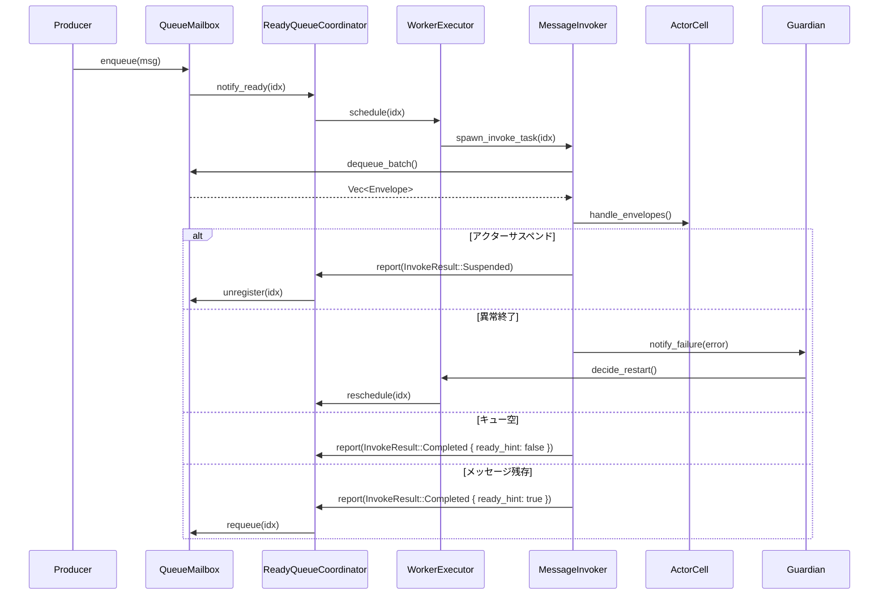
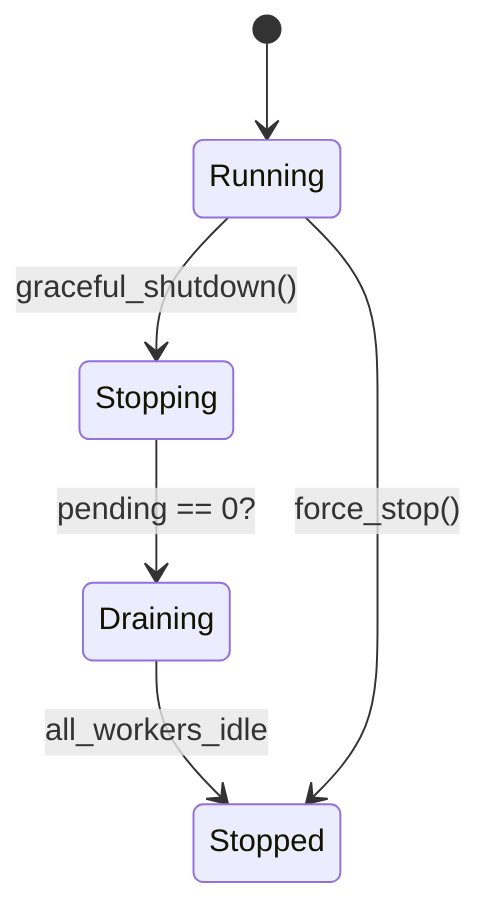

# ActorScheduler ファサード再設計指針 (更新: 2025-10-21)

## 1. 背景
- 現行の `ActorScheduler` / `ReadyQueueScheduler` は multi-worker ready queue、Guardian 連携、エスカレーション配信、メトリクス・テレメトリ、receive timeout などの高度な機能を単一コンポーネントに抱え込んでいる。
- 旧 `dispatcher` 実装（`docs/sources/nexus-actor-rs/modules/actor-std/src/actor/dispatch/`）は Dispatcher / Mailbox / Invoker / Throttler へ責務を分割し SRP を徹底しており、protoactor-go を含む参照実装も同様の境界を持つ。
- Shared 抽象と async モデルへ移行する再設計の中で、ReadyQueueScheduler を facade とした責務再編を行い、再利用・テスト容易性を高めたい。
- 本ドキュメントは以下のドキュメント（旧: `actor_scheduler_mailbox_facade.md`, `D22-mailbox-readyqueue-facade.md`）を統合し、設計観点とロードマップを一貫させた最新版である。

## 2. 現状整理
1. `ReadyQueueScheduler` が Ready queue 管理、ワーカ駆動、Guardian 戦略、エスカレーション配信、Failure Telemetry、Metrics Sink、receive timeout 共有を併せ持ち、外向けファサードと内部オーケストレーションを兼任している。
2. `ActorCell` には mailbox 直接操作、メッセージ処理ループ、子アクター生成、サスペンド判定、Failure 通知といった Invoker 相当の責務が集中している。
3. `Mailbox` は `ActorCell` 経由でのみ所有されており、enqueue/notify と ReadyQueue 再登録、enqueue メトリクス記録に特化している。

| レイヤ | 主な型 | 現行責務 |
| --- | --- | --- |
| Mailbox | `QueueMailbox`, `QueueMailboxProducer` | enqueue/notify、ReadyQueue への再登録、enqueue メトリクス |
| Invoker 相当 | `ActorCell` | 優先度バッチ処理、System/User メッセージ分岐、サスペンド制御、Failure 伝播 |
| Dispatcher 相当 | `ReadyQueueScheduler`, `ReadyQueueWorkerImpl` | Ready index 管理、ActorCell の処理・再待機、ワーカ駆動 |
| ランタイム駆動 | `ActorSystemRunner`, `runtime_driver.rs` | ランタイムタスク生成、ワーカ数調整、shutdown 協調 |

## 3. 課題
- Mailbox ↔ Scheduler ↔ Invoker の境界が暗黙的で、API から意図が読み取りづらい。
- Suspend/Resume、middleware、詳細メトリクスなど旧機能が ActorCell／ReadyQueue に散在し拡張ポイントが不鮮明。
- ReadyQueueScheduler の内部構造が把握しづらく、Dispatcher/Invoker の概念が欠落しているため説明とテストが難しい。
- Shared 抽象や `no_std` 向け構成を想定したとき、現行の強結合がボトルネックになる。
- メトリクス、バックプレッシャ、receive timeout 等の TODO が複数ドキュメントに分散し、優先順位が不明瞭。

## 4. 目標アーキテクチャ

### 4.1 コンポーネント構成
1. **Mailbox Core**: QueueMailbox を中心に enqueue・シグナル通知・ReadyQueueHook 連携を担う純粋なデータ構造。`MailboxOptions` で容量・`OverflowStrategy`・システムメッセージ用予約枠を設定し、バックプレッシャ閾値や middleware hook をオプション化する。
2. **Scheduler Facade**: ReadyQueueScheduler を外部 API の窓口としつつ、内部をサブコンポーネントへ分割。
   - `ReadyQueueCoordinator`: `drain_ready_cycle` / `poll_wait_signal` による ready queue 走査とワーカ調停を担当。
   - `WorkerExecutor`: ランタイム依存のタスク生成・ワーカ駆動・再スケジュール要求を扱う。
   - `MessageInvoker`: ActorCell に代わりメッセージ実行ループを抽象化し、Suspend/Resume や Guardian 通知を集中させる。
3. **Observability Hub**: Failure Telemetry / Metrics Sink / トレース送出を統一的に収集し、enqueue/dequeue の計測ポイントを整理する。
4. **Mailbox Registry**: Mailbox 生成・再利用・所有権管理を行い、spawn フローや再登録処理を簡素化する。
5. **Execution Runtime**: `ActorSystemRunner` や各種ランタイムハンドルが WorkerExecutor を経由してワーカ数調整・shutdown 協調を行う。Tokio / Embassy / テスト環境で共通トレイトを共有。

### 4.2 イベントフロー（案）
1. Producer が QueueMailbox へ enqueue し、シグナル通知で ReadyQueueHook を呼び出す。
2. ReadyQueueCoordinator が mailbox index を ready queue へ登録し、WorkerExecutor へ処理要求を渡す。
3. WorkerExecutor がランタイムタスクを生成し、MessageInvoker を実行する。
4. MessageInvoker が Envelope バッチ処理・Suspend/Resume 判定・Guardian/Telemetry 連携を担い、処理結果に応じて ReadyQueueCoordinator に再登録指示を返す。



Suspend 状態の mail box 着信や異常時のガーディアン連携など主要な分岐を明示し、エッジケースをアーキテクチャレベルで把握できるようにする。
バックプレッシャ判定およびミドルウェアチェインの詳細フローは Phase 2B にて `scheduler_sequences.puml` として拡張し、Invokers の拡張ポイント設計と合わせて公開する。

### 4.3 責務境界ガイドライン
- Facade（ReadyQueueScheduler）は外部 API と内部コンポーネント初期化のみに注力し、実際の処理は Coordinator/Executor/Invoker に委譲する。
- Mailbox Core はスレッド安全性と通知保証に専念し、業務ロジックを含まない。
- システム/制御メッセージは常に専用バッファまたは予約枠を介して優先処理し、バックプレッシャによる抑止を受けない。
- Observability Hub は enqueue/dequeue/エスカレーションなど全体の計測ポイントを一元管理し、個別コンポーネントからメトリクス実装を排除する。
- Mailbox Registry が lifecycle を束ねることで、ActorCell から mailbox 生成・破棄ロジックを切り離す。

### 4.4 トレイトとインタフェース素案
以下は Phase 1〜2 で導入する主要トレイトのドラフトであり、実装検討時に調整する。

```rust
use core::num::NonZeroUsize;
use core::task::{Context, Poll};
use core::time::Duration;
use smallvec::SmallVec;

/// Ready queue を走査しワーカ調停を担うコンポーネントの共通インタフェース
pub trait ReadyQueueCoordinator: Send + Sync {
    /// mailbox を ready queue に登録する
    fn register_ready(&mut self, idx: MailboxIndex);

    /// mailbox を ready queue から除外する
    fn unregister(&mut self, idx: MailboxIndex);

    /// ready queue から処理候補を取得する（呼び出し側がバッファを所有）
    fn drain_ready_cycle(&mut self, max_batch: usize, out: &mut SmallVec<[MailboxIndex; 64]>);

    /// シグナル到来をポーリングする（ノンブロッキング、ノンアロケ）
    fn poll_wait_signal(&mut self, cx: &mut Context<'_>) -> Poll<()>;

    /// Invoker からの結果を受け取り再登録や抑止を決定する
    fn handle_invoke_result(&mut self, idx: MailboxIndex, result: InvokeResult);
}

/// メッセージ実行ループを抽象化し、Suspend/Resume や失敗処理を集中させる
pub trait MessageInvoker: Send {
    fn invoke_batch(&mut self, max_messages: usize) -> InvokeResult;
    fn actor_state(&self) -> ActorState;
}

#[derive(Debug, Clone, PartialEq)]
pub enum InvokeResult {
    Completed { ready_hint: bool },
    Yielded,
    Suspended { reason: SuspendReason, resume_on: ResumeCondition },
    Failed { error: ActorError, retry_after: Option<Duration> },
    Stopped,
}

#[derive(Debug, Clone, PartialEq)]
pub enum SuspendReason {
    Backpressure,
    AwaitExternal,
    RateLimit,
    UserDefined,
}

#[derive(Debug, Clone, PartialEq)]
pub enum ResumeCondition {
    ExternalSignal(SignalKey),
    After(Duration),
    WhenCapacityAvailable,
}

#[derive(Debug, Clone, Copy, PartialEq, Eq, Hash)]
pub struct SignalKey(pub u64);

#[derive(Debug, Clone, Copy, PartialEq, Eq)]
pub enum OverflowStrategy {
    DropOldest,
    DropNewest,
    BlockProducer,
    Reject,
    DeadLetter,
}

pub struct MailboxOptions {
    pub capacity: NonZeroUsize,
    pub overflow: OverflowStrategy,
    pub reserve_for_system: usize,
}

#[derive(Debug, Clone, Copy, PartialEq)]
pub enum ActorState {
    Running,
    Suspended,
    Stopping,
    Stopped,
}

/// MessageInvoker 実装に前後処理を提供するミドルウェアチェイン
pub trait MiddlewareChain {
    fn before_invoke(&mut self, ctx: &InvokeContext) -> ControlFlow<(), ()>;
    fn after_invoke(&mut self, ctx: &InvokeContext, result: &InvokeResult);
}
```

#### 4.4.1 参考実装スケッチ
- `DefaultReadyQueueCoordinator`: `DashSet<MailboxIndex>` と MPMC シグナルチャネルで重複登録を抑制しつつ ready index をバッチ取得する。`drain_ready_cycle` は呼び出し側提供の `SmallVec<[MailboxIndex; 64]>` を埋め、`poll_wait_signal` でノンアロケな待機を実現する。`wait_for_signal_async` のような薄いラッパは `std` feature でのみ提供し、組み込み環境では `poll_wait_signal` を直接利用する。
- `ActorCellInvoker`: Suspend 状態を先に評価し、Middleware の `before_invoke` で `ControlFlow::Break` が返った場合は処理を保留する。`process_messages_batch` の結果が `Err` の際は `InvokeResult::Failed { retry_after }` を返し、連続失敗回数とガーディアン方針からバックオフ時間を算出する。
- `CompositeMiddleware`: 先入れ先出しで `before_invoke` を呼び、`after_invoke` は逆順で実行してリソース開放順序を制御する。テレメトリやロギングはここで集約する。
- 優先度制御は QueueMailbox 側で完結させる。System メッセージは `system_queue`、通常メッセージは `user_queue` に分離し、`dequeue_batch` 時に system → user の順で取り出す。Invoker から見たメッセージ列は既に優先度順となり、追加の分岐を要しない。
- Mailbox は `MailboxOptions` を通じて容量・溢れ戦略を設定する。`reserve_for_system` によりシステムメッセージ枠を確保し、`OverflowStrategy` で DropOldest/BlockProducer などを選択する。enqueue 成功/失敗は Observability Hub にフックし、オーバーフロー理由をメトリクスへ送出する。

```rust
impl QueueMailbox {
    pub fn dequeue_batch(&self, max: usize) -> Vec<Envelope> {
        let mut batch = Vec::with_capacity(max);
        while batch.len() < max {
            if let Some(env) = self.system_queue.pop_front() {
                batch.push(env);
            } else {
                break;
            }
        }
        while batch.len() < max {
            if let Some(env) = self.user_queue.pop_front() {
                batch.push(env);
            } else {
                break;
            }
        }
        batch
    }
}
```

#### 4.4.2 エラーハンドリング方針
- `InvokeResult::Failed` は `retry_after` を介して指数バックオフなどの再試行待機を表現し、Guardian 側で再起動／停止／エスカレーションを選択できる情報を含める。最終判断は Guardian に委譲する。
- 致命的な mailbox 異常（enqueue 失敗など）は `ReadyQueueCoordinator` へ `InvokeResult::Failed` を返した後に `MailboxRegistry` へ通知し、再割当てやデッドレターへの転送を行う。これらの経路は Phase 2B で具体化する。
- Guardian 連携は非同期チャネルで行う。`ActorCellInvoker` が失敗を検出した際に `FailureNotification` を `guardian_tx.try_send` し、Guardian スレッドが `SupervisionDirective` を決定のうえ `WorkerExecutor` へ `SupervisionCommand` を返す。Invoker は Guardian の応答を待たずに `InvokeResult` を返し、スーパービジョンとスケジューリングを疎結合に保つ。
- Guardian は Akka にならい、`max_restarts` と `within` を設定して再起動ストームを抑止する。`InvokeResult::Failed { retry_after: Some(duration) }` を返すことで Executor が再キュー前に指数バックオフを適用できるようにし、しきい値超過時は `SupervisionDirective::Stop` へ移行する。

### 4.5 ActorCell の最終像と役割
- ActorCell 自体はアクター状態管理・監視登録・子アクター生成 API の提供に専念し、メッセージ実行ループは `MessageInvoker` へ移譲する。
- ActorCell の公開 API は最小化し、Invoker 実装が参照するメソッド（`dequeue`, `is_suspended`, `notify_guardian` など）は内部モジュールに限定する。MailboxRegistry が `Arc<ActorCell>` を所有し、アクター停止時には Registry 経由で `terminate()`→`unregister_mailbox()`→Coordinator の `unregister()` を順に呼び出すライフサイクルを Phase 2B で確立する。
- 将来的に ActorCell を段階的に縮退させ、`ActorContext` 相当の薄いラッパとして再配置する方針を Phase 2B で検証する。

### 4.6 現行実装コンポーネントとの対応関係

| 現行コンポーネント | 役割 | 移行後の対応先 | 補足 |
| --- | --- | --- | --- |
| `ReadyQueueState` (`VecDeque` + `queued/running` ビットセット) | Ready queue の実データとワーカ状態トラッキング | `ReadyQueueCoordinator` 内部の `QueueState` (仮称) | Coordinator が所有する `ArcShared<Mutex<QueueState>>` に組み込み、API を通じてのみ操作する。構造体名は Phase 1 で確定。 |
| `ReadyQueueNotifier` / `ReadyEventHook` | Mailbox からの ready シグナルを受け取り、queue へ登録 | `ReadyQueueCoordinator::register_ready` とランタイム固有実装内のシグナル処理 | 通知経路は温存しつつ、Coordinator が再登録／重複排除を担う。 |
| `ReadyQueueScheduler::state` フィールド | Ready queue 状態の共有 | `ReadyQueueCoordinator` へ移譲 | Scheduler は Coordinator 生成と委譲のみを行い、状態への直接アクセスを廃止。 |
| `ReadyQueueWorkerImpl` | queue から index を取り出し ActorCell を駆動 | `WorkerExecutor` | Executor が受け取った index を元に Invoker 実行を orchestrate。 |
| `ReadyQueueContext` | Ready queue 操作用コンテキスト | `ReadyQueueCoordinator` (公開) + `MailboxRegistry` (内部) | Mailbox 再登録や capacity 管理は Coordinator に集約。Registry は mailbox ライフサイクル管理に専念。 |

ReadyQueueState 自体は廃止するのではなく、新しい `ReadyQueueCoordinator` の内部状態として再利用する。Coordinator は QueueState への排他アクセスを抽象化し、メソッド単位で安全な操作（enqueue, drain, mark_running, mark_idle 等）を提供する。これにより従来の `ReadyQueueState` の責務は `ReadyQueueCoordinator` に内包され、Scheduler 側からの直接操作はなくなるがデータモデルは維持される。

### 4.7 ReadyQueueCoordinator と WorkerExecutor の協調モデル
- `ReadyQueueCoordinator` は ready queue の状態（`QueueState`）とシグナルチャネルを保持し、`register_ready`／`drain_ready_cycle`／`unregister` を通じたキュー操作を一元管理する。Coordinator は `ArcShared<Mutex<QueueState>>` を内部に持ち、外部呼び出しは常にメソッド経由となるため、複数ワーカからの呼び出しでもメモリ安全を保つ。
- `WorkerExecutor` が Coordinator を所有し、ワーカタスク（Tokio/Embassy/テスト用ランタイム）を spawn してメインループを駆動する。Executor から見た Coordinator は `ArcShared<dyn ReadyQueueCoordinator>` として参照され、ワーカ起動数は Phase 1 では固定値で構わない。

- 初期段階では `ArcShared<Mutex<QueueState>>` で一極管理するが、`drain_ready_cycle` と `handle_invoke_result` のクリティカルセクションを最小化しロック保持時間を短くする。将来的には lock-free MPSC や per-worker ローカルキューを併用する設計（ワークスティーリング等）を Phase 3 以降の検討項目として追跡し、ベンチマークでロック待ち時間を計測する。



Coordinator と Executor は上記ライフサイクルを共有し、Stopping 中は新規 enqueue を拒否して既存メッセージのみ処理する。Draining で ready queue とワーカからの inflight を空にした後、Stopped でリソースを Registry が解放する。

```rust
pub struct WorkerExecutor<R: ReadyQueueCoordinator, H: RuntimeHandle> {
    coordinator: ArcShared<R>,
    runtime: H,
    worker_batch: usize,
}

impl<R, H> WorkerExecutor<R, H>
where
    R: ReadyQueueCoordinator + 'static,
    H: RuntimeHandle + Clone + 'static,
{
    pub fn start_workers(&self, num_workers: usize) {
        for worker_id in 0..num_workers {
            let coordinator = self.coordinator.clone();
            let runtime = self.runtime.clone();
            let max_batch = self.worker_batch;
            runtime.spawn(async move {
                let mut buffer = SmallVec::<[MailboxIndex; 64]>::new();
                loop {
                    runtime
                        .wait_with(|cx| coordinator.lock().poll_wait_signal(cx))
                        .await;

                    buffer.clear();
                    coordinator.lock().drain_ready_cycle(max_batch, &mut buffer);

                    for idx in buffer.iter().copied() {
                        let result = runtime.invoke(idx).await;
                        coordinator.lock().handle_invoke_result(idx, result);
                    }
                }
            }, worker_id);
        }
    }
}
```

- Coordinator 実装は内部ロックと `SmallVec` を併用し、`drain_ready_cycle` で割り当てを伴わずに候補を抽出する。Runtime 固有の `invoke` は `MailboxIndex` を受け取り、`MessageInvoker` を生成して実行する。
- `wait_for_signal` は `Pin<Box<dyn Future<Output = ()> + Send>>` を返し、Tokio・Embassy いずれでも `await` 可能な形式に統一する。同期ランタイム向けには `block_on` ラッパを提供する。
- `handle_invoke_result` は `InvokeResult` に応じて `register_ready`／`unregister` を内部的に呼び出す薄いヘルパーで、Executor 側の分岐を最小化する。
- `RuntimeHandle` トレイトは `spawn`／`invoke` を提供し、Tokio 版は `tokio::spawn`・`ActorCellInvoker` を、Embassy 版は `Spawner::spawn`・`executor::run` を薄くラップする。Phase 1 ではホスト用実装のみ提供し、Phase 3 で no_std 向け派生を追加する。
- `RuntimeHandle::wait_with` は `poll_wait_signal` を Future に変換する薄いアダプタであり、Tokio では `poll_fn`、Embassy では `Executor::run` 上での await に写像する。
- ワーカ数の動的調整は Phase 4 の検討課題とし、Phase 1–3 は固定ワーカ数＋`worker_batch` 調整で性能評価を行う。
- Receive timeout はハッシュドホイールタイマ（デフォルト）または最小ヒープタイマを Coordinator 配下のサブモジュールとして実装し、timeout 到達時は system メッセージとして再投入する。これにより async タスクを大量生成せずにタイムアウトを管理できる。

### 4.8 MailboxRegistry と所有権モデル
- `MailboxRegistry` が Mailbox/ActorCell のライフサイクルを管理し、`MailboxIndex` ↔ `Arc<QueueMailbox>` のルックアップを提供する。登録時に `ActorCell` と `QueueMailbox` を生成し、インデックスを払い出す。

```rust
pub trait MailboxRegistry: Send + Sync {
    fn register_mailbox(&mut self, cell: Arc<ActorCell>, mailbox: Arc<QueueMailbox>) -> MailboxIndex;
    fn get_mailbox(&self, idx: MailboxIndex) -> Option<Arc<QueueMailbox>>;
    fn get_actor_cell(&self, idx: MailboxIndex) -> Option<Arc<ActorCell>>;
    fn unregister_mailbox(&mut self, idx: MailboxIndex) -> bool;
}

pub fn spawn_actor<R: MailboxRegistry>(registry: &mut R, props: Props) -> Result<MailboxIndex, SpawnError> {
    let actor_cell = Arc::new(ActorCell::new(props));
    let mailbox = Arc::new(QueueMailbox::default());
    let idx = registry.register_mailbox(actor_cell.clone(), mailbox.clone());
    actor_cell.set_mailbox_index(idx);
    Ok(idx)
}
```
- `MessageInvoker` は `MailboxRegistry` を参照し、`MailboxIndex` から必要なリソースを解決する。Invoker 初期化時に `registry.get_mailbox(idx)` と `registry.get_actor_cell(idx)` を取得しキャッシュすることで、ホットパスでのロック回数を抑える。
- アクター停止時は Registry が `ActorCell::terminate()` → `unregister_mailbox()` → `ReadyQueueCoordinator::unregister()` を順番に呼び、スーパービジョンの指示に基づき再起動する場合は `spawn_actor` を再実行する。
- Index 再利用による誤アクセスを防ぐため `MailboxIndex` はスロット番号と世代番号を保持する。

```rust
#[derive(Clone, Copy, Debug, PartialEq, Eq, Hash)]
pub struct MailboxIndex {
    pub slot: u32,
    pub generation: u32,
}
```

Registry は内部に世代カウンタ付きテーブルを持ち、`unregister_mailbox` 時に世代を進めることで古いハンドルからの use-after-free を防止する。
- `MailboxHandle` / `ActorCellHandle` の `Shared` 型は以下の通り。std 環境では `ArcShared`、no_std では `RcShared` を用いる。

```rust
#[cfg(feature = "std")]
type MailboxHandle<T> = ArcShared<T>;

#[cfg(not(feature = "std"))]
type MailboxHandle<T> = RcShared<T>;

#[cfg(feature = "std")]
type RegistryHandle = ArcShared<dyn MailboxRegistry>;

#[cfg(not(feature = "std"))]
type RegistryHandle = SharedDyn<dyn MailboxRegistry>;
```

- `SharedDyn` は `MailboxRegistry` をトレイトオブジェクトとして共有する際に利用し、ランタイム間で統一したハンドル表現を提供する。

### 4.9 命名方針と参照実装との整合
- protoactor-go / Akka / Erlang に倣い、責務語彙を「調整 (Coordinator)」「実行 (Executor)」「呼び出し (Invoker)」へ揃えた。`Driver` という語はハードウェア抽象を指すことが多く、本設計の責務（キュー調整・ワーカ調停）と齟齬があるため採用しない。
- `ReadyQueueCoordinator` は protoactor-go の `Dispatcher` が担う「実行前キュー調停」レイヤと位置づけ、`WorkerExecutor` はワーカ実行戦略（goroutine/tokio タスク等）を担う層として区別する。`MessageInvoker` は protoactor-go の命名と一致させ、メッセージ実行責務であることを明確化した。
- 以下の命名変換を Phase 0 でドキュメント化し、実装後もズレが生じないよう `docs/adr/2025-10-Phase0-naming.md` に記録する。

| 旧名称 (検討時) | 新名称 | 参照実装での対応 | 主な責務 |
| --- | --- | --- | --- |
| ReadyQueueDriver | **ReadyQueueCoordinator** | protoactor-go `MailboxScheduler` / Akka `Dispatcher` | Ready queue の調整・シグナル管理・再登録制御 |
| MessageDispatcher | **WorkerExecutor** | protoactor-go `Dispatcher`(タスク実行) / Akka `ExecutorService` | ランタイムタスク生成・ワーカ駆動・Invoker 呼び出し |
| MessageInvoker | MessageInvoker | protoactor-go `MessageInvoker` | メッセージ実行・Suspend/Resume 判定・Guardian 連携 |

- Phase 4 の命名整理では `ReadyQueueScheduler`（Facade）を `ActorSchedulerFacade`（仮称）へ改称する案も検討する。最終判断は命名 ADR で合意し、コードと設計書を同時に更新する。

### 4.10 観測指標とトレース方針
- Metrics 最低ライン: `actor.mailbox.enqueued_total{actor,mailbox}`, `actor.mailbox.depth{actor}`, `scheduler.ready_queue.depth`, `scheduler.worker.busy_ratio{worker}`, `scheduler.invoke.duration_ms{actor}`, `scheduler.latency_ms{actor}`, `dead_letters_total{reason}`。
- Tracing は enqueue→dequeue→invoke を一つの span に関連付け、`SignalKey` を trace id に含める。Observability Hub がメトリクスと span の集約点となり、レイテンシ回帰を即座に検知できるようにする。

## 5. フェーズ別ロードマップ
| フェーズ | 目標 | 主なタスク |
| --- | --- | --- |
| Phase 0 | 現状の境界を明文化し PoC の前提を固める | 責務マッピング図・依存グラフ作成、テレメトリ/metrics 現状整理、ReadyQueueScheduler 公開 API 維持方針と移行戦略の合意 |
| Phase 1 | Ready queue 処理の抽出 | `ReadyQueueCoordinator` トレイト導入、`drain_ready_cycle` 等の移動、Facade から Coordinator への委譲、単体・統合テスト整備、ベンチマーク更新 |
| Phase 2A | WorkerExecutor の導入 | ランタイムタスク生成抽象化、ワーカ駆動ロジックの移動、Tokio/Embassy/テスト用実装スケルトン作成、feature flag による切り替え実装 |
| Phase 2B | MessageInvoker 導入と旧機能再統合 | ActorCell からのメッセージ実行抽出、Suspend/Resume・middleware・バックプレッシャ再配置、Guardian/エスカレーション通知の抽象化、`ActorCell` API 整理 |
| Phase 3 | Mailbox Registry と Observability Hub の整備 | Mailbox lifecycle 集中管理、enqueue/dequeue 計測統一、Metrics Sink 連携、バックプレッシャ設定の外部化、no_std 対応確認 |
| Phase 4 | 統合・命名整理・最終最適化 | 命名整備（`ActorSchedulerFacade` への改名是非）、ランタイムハンドル共通化、パフォーマンスチューニング、移行ガイドと ADR ドキュメント化 |

### 5.1 フェーズ完了条件（Definition of Done）
- **Phase 0**: 責務マッピング図（PlantUML）と依存グラフがリポジトリに追加され、ベースラインベンチマーク結果（`baseline_before_refactor.md`）が共有されている。Suspend/Resume 責務に関する ADR 草案がレビュー中である。
- **Phase 1**: `ReadyQueueCoordinator` 実装が既存テスト＋新規単体テスト（正常系 8 / 異常系 7 / 境界値 5 の計 20 ケース以上、ライン＋ブランチカバレッジ 100%）を通過し、レイテンシ劣化 < 5%、スループット維持 ≥ 95%、メモリオーバーヘッド < 10% をベンチマークで確認。既存の `ReadyQueueState` テストは `queue_state/tests.rs` として移植し、新旧比較（DashSet vs Mutex）テストを追加する。feature flag による旧実装切り替えが可能で、統合テスト 5 シナリオ（単一アクター、100 アクター並列 10k メッセージ、1000 アクタースパイク、Suspend/Resume 連続、異常終了→再起動）を網羅し、各シナリオが 30 秒以内に完了することを確認する。
- **Phase 2A**: WorkerExecutor 抽象導入後も 10,000 メッセージ/秒 × 100 アクター統合テストが安定動作し、Tokio/Embassy/テスト向けの最小実装が揃う。ランタイム別統合テスト 15 ケース、レイテンシ劣化は Phase 1 比で追加 3% 以内。
- **Phase 2B**: MessageInvoker 実装が Suspend/Resume・middleware・バックプレッシャを内包し、Guardian 連携の回帰テストを通過。`ActorCell` 公開 API からメッセージ実行関連メソッドが削減され、ミドルウェア関連テスト 7 ケース・Guardian テスト 5 ケース・バックプレッシャ テスト 5 ケースを含む 25 ケース以上の単体テストが追加されている。
- **Phase 3**: Mailbox Registry と Observability Hub が導入され、enqueue/dequeue 両方向のメトリクスが Metrics Sink へ送出される。no_std ターゲット（`thumbv6m-none-eabi`, `thumbv8m.main-none-eabi`）で `cargo check` が通過し、必要に応じて QEMU + Embassy executor を用いた軽量統合テスト（3 アクター × 100 メッセージ）が成功する。Observability Hub の統合テスト 10 ケースを追加し、メトリクス送出がロックフリーであることをベンチマークで確認する。
- **Phase 4**: 命名方針（Facade を `ActorSchedulerFacade` へ改称するか等）が ADR で確定し、移行ガイド・パフォーマンスレポート・トラブルシュートガイドが公開。feature flag をデフォルトで新実装に切り替え、旧実装削除が完了。1 週間のステージング観測とパフォーマンス回帰レポートがまとめられている。

### 5.2 パフォーマンスベースラインと計測計画
#### ベースライン定義
- ベースラインは **Phase 0 時点の現行 `ReadyQueueScheduler` 実装** とする。`main` ブランチで取得したベンチマーク結果（`benchmarks/baseline_phase0.txt`）を金標準として保管し、以降のフェーズは常にこのファイルと比較する。
- 取得コマンド例:
  ```bash
  cargo bench --bench mailbox_throughput > benchmarks/baseline_phase0.txt
  cargo bench --bench scheduler_latency >> benchmarks/baseline_phase0.txt
  ```
- Phase 1 以降は `--features new-scheduler` を付与し、新旧実装を同条件で測定する。比較は `scripts/compare_benchmarks.py baseline_phase0.txt current.txt --threshold 0.05` で自動化する。

#### 計測指標と許容値
- **レイテンシ**（enqueue → actor receive）: p50 / p95 / p99 を計測。目標は Phase 1 で +5% 以内、Phase 2 合計で +10% 以内、Phase 3 以降は Phase 0 比 +5% 以内へ戻し込み。
- **スループット**（messages/sec）: 1, 10, 100, 1000 アクター構成で測定。Phase 1 で 95% 以上、Phase 2 合計で 90% 以上、Phase 3 で 95% 回復を目指す。
- **CPU 使用率**: `perf stat` でワーカーごとの命令/サイクル数を取得。回帰が 10% を超える場合は設計を見直す。
- **メモリ使用量**: アクターあたりのヒープ使用量（目標 < 2KB/actor）と ReadyQueueCoordinator/Registry の常駐メモリを追跡する。

#### 測定手順
1. `feature/new-scheduler` を切り替えながら、同一ベンチマークを 3 回繰り返して中央値を採用。
2. `valgrind --tool=massif` と `jemalloc` 統計を用い、メモリオーバーヘッド（ヒープ増加率 < 10%）を検証。
3. `scripts/bench_concurrency.rs` を追加し、DashSet 版と Mutex<HashSet> 版の `register_ready` を 10 スレッドで比較。DashSet 版が 20% 以上高速であるかを確認し、結果を `benchmarks/concurrency_comparison.md` に記録。

#### ベンチマーク自動化
- `.github/workflows/benchmarks.yml` で夜間ジョブを実行し、結果を Artifact として保存する。閾値（5% 劣化）を超えた場合は Slack に通知し、失敗したジョブは `benchmark-results` を添付する。
- `ci/benchmarks.yml` には環境変数 `MALLOC_CONF=stats_print:true` を設定し、メモリ統計をログ出力する。
- 回帰検知スクリプトは Phase 0 で実装し、Phase 1 完了前に CI へ組み込む。

### 5.3 ロールバック戦略
- 各フェーズで `cfg(feature = "new-scheduler")` の feature flag を維持し、致命的な回帰発生時は即座に旧実装へ戻せるようにする。
- Feature flag のデフォルト切り替えは Phase 4 完了時とし、1 週間のステージング観測を経て旧実装コードを削除する。
- ロールバック手順書を `docs/migration/scheduler_refactor_rollback.md` として作成し、運用手順を明文化する。

### 5.4 命名と no_std 方針
- 命名は Phase 1 時点で `Dispatcher` など最終的な呼称を仮決定し、以降のフェーズでは同名称で統一。Phase 4 で最終判断とドキュメント反映を行う。
- `ReadyQueueCoordinator`・`WorkerExecutor`・`MessageInvoker` は `alloc` ベースで実装し、`std` 依存機能（`Arc`, `Mutex` など）は `Shared` 抽象を経由させる。no_std 対応のスモールテストを Phase 3 で追加する。
- ワーカ数は Phase 1-3 で固定値（設定ファイルまたは `ActorSystemConfig`）とし、Phase 4 で `AdaptiveDispatcher` による動的調整アルゴリズム（キュー長と待機時間を指標に増減）を評価する。設計検討時は `stateDiagram` でワーカライフサイクル（Spawned/Running/Draining/Stopped）を整理する。

## 6. 既存 TODO・関連ドキュメントとの整合
- `D14-mailbox-runtime-next-actions.md`: Send/Sync 境界精査、MailboxOptions 拡張、プリセット API、クロスビルド CI、メトリクス整備を Phase 2-3 のサブタスクとして取り込む。
- `D13-ready-queue-next-actions.md`: ワーカチューニング、Spawn ミドルウェア統合、観測ポイント強化を Coordinator/Executor のロードマップに紐付け。
- `docs/design/archive/2025-10-13-mailbox-runtime-status.md`: QueueMailboxProducer の SingleThread 対応や metrics 仕上げを Phase 2 の継続課題として追跡。

## 7. オープン課題と優先度

| 優先度 | 課題 | 対応フェーズ | 補足 |
| --- | --- | --- | --- |
| P0 | Suspend/Resume の責務配置を Invoker 内に固定するかの判断 | Phase 0 | ReadyQueueCoordinator が状態を持たない方針を ADR で確定 |
| P1 | Middleware API 再導入の位置付け | Phase 2B | Invoker でミドルウェアチェインを提供し、Registry からの注入を検討 |
| P1 | Mailbox Registry が担うライフサイクル境界の明確化 | Phase 2B | 所有権とリソース解放手順を図示し、テストで検証 |
| P1 | MailboxIndex の世代管理と再利用安全性 | Phase 1 | Generational Index を導入し、loom ベースの検証を実施 |
| P2 | MetricsSink の lock-free 化と enqueue/dequeue の統合計測 | Phase 3 | Observability Hub 実装で達成、ベンチマークでオーバーヘッド確認 |
| P2 | Shared 抽象と no_std ターゲットでの互換性確保 | Phase 3 | `SharedDyn` の API 固定、thumbv6m/ thumbv8m ターゲットで `cargo check` を実施 |
| P2 | Facade 化によるレイテンシ影響の継続測定 | Phase 1 以降継続 | 各フェーズでベンチマーク比較、許容値超過時は設計見直し |

Suspend/Resume は Invoker 内で状態を評価し、`InvokeResult::Suspended` を返却することで ReadyQueueCoordinator が `unregister(idx)` を実行する。Resume 時は ActorCell が自身の状態を `Running` に戻したうえで `MailboxRegistry` 経由で `coordinator.register_ready(idx)` を呼び、未処理メッセージがあればキューへ再登録する。シグナル伝播経路（ActorCell → Registry → Coordinator → WorkerExecutor）は Phase 2B で `scheduler_sequences.puml` に反映し、テストケースでは Suspend → Resume 循環および再起動後の再登録を確認する。

## 8. 次アクション（直近 2 週間）

### 担当: アーキテクトチーム
- [ ] Week 1: PlantUML で責務マッピング図・シーケンス図を作成し、`docs/design/scheduler_component_mapping.puml` として追加。
- [ ] Week 1: 依存関係グラフ（`cargo depgraph` 等）を生成し、`docs/design/scheduler_dependency_graph.md` に整理。
- [ ] Week 1: 命名ポリシー ADR（`docs/adr/2025-10-Phase0-naming.md`）を起草し、`Coordinator/Executor/Invoker` 採用の根拠と最終命名案を確定。
- [ ] Week 2: Suspend/Resume 責務に関する ADR（`docs/adr/2025-10-Phase0-suspend-resume.md`）を起草し、レビューアサイン。
- [ ] Week 2: バックプレッシャおよびミドルウェアチェインの詳細シーケンス図を `docs/design/scheduler_sequences.puml` に追記し、Phase 2B の参考資料とする。
- [ ] Week 2: 実装 FAQ（`docs/design/scheduler_implementation_faq.md`）を起草し、A1/A2/B1/D1 のQ&Aを整理する。

### 担当: 実装チーム
- [ ] Week 1: `feature/ready-queue-coordinator-poc` ブランチで `ReadyQueueCoordinator` プロトタイプとテスト（`core/src/actor/dispatch/ready_queue_coordinator.rs` / `tests.rs`）を実装。
- [ ] Week 1: `cargo bench --bench mailbox_throughput` / `scheduler_latency` を実行し、ベースライン結果を `benchmarks/baseline_before_refactor.md` に保管。
- [ ] Week 2: `MessageInvoker` トレイト素案と ActorCell 切り出しドラフトを `docs/design/message_invoker_draft.md` にまとめ、レビュー用 PR を作成。
- [ ] Week 2: Phase 1 実装ガイド（`docs/implementation/phase1_implementation_guide.md`）を作成し、テスト移行手順・ワーカループ実装例を明文化する。
- [ ] Week 2: Generational MailboxIndex（slot + generation）と loom を用いた並行性テストの計画を `docs/design/mailbox_registry_generational.md` に整理。

### 担当: QA / SRE
- [ ] Week 2: ベンチマークジョブを CI に追加し、回帰検知時に Slack 通知が飛ぶよう `ci/benchmarks.yml` を更新。
- [ ] Week 2: ロールバック手順書テンプレートを `docs/migration/scheduler_refactor_rollback.md` に用意し、Phase 1 完了前にドラフト化。
- [ ] Week 2: ADR テンプレート（`docs/adr/template.md`）を整備し、Phase 0 以降の設計判断が記録しやすい体裁を用意する。
- [ ] Week 2: `scripts/compare_benchmarks.py` と `ci/scripts/collect_memory_stats.sh` を追加し、CI ベンチマークの自動比較・メモリ統計収集を可能にする。

## 9. 成果物イメージ
- `ReadyQueueCoordinator` / `WorkerExecutor` / `MessageInvoker` のモジュール設計書とトレイト仕様書。
- QueueMailbox / ReadyQueueScheduler の API ドキュメント更新案。
- ランタイム driver（Tokio, Embassy, Local）に対する統合テストと運用ガイド。
- ベンチマーク結果レポート（ベースラインと各フェーズ比較）、パフォーマンス回帰時のトリアージ手順書。
- 移行ガイド・ロールバック手順・トラブルシュートガイドのテンプレート群。

## 10. 実装詳細 FAQ（抜粋）

**Q1. `MailboxIndex` から実際の Mailbox をどう取得する？**  
`MailboxRegistry` が `register_mailbox` 時にインデックスを払い出し、`get_mailbox(idx)` で `Arc<QueueMailbox>` を返す。`MessageInvoker` は初期化時に Registry から Mailbox/ActorCell を取得しキャッシュするため、ホットパスでのロックは最小限。詳細はセクション 4.8 を参照。

**Q2. ReadyQueueCoordinator と WorkerExecutor はどちらがメインループを持つ？**  
WorkerExecutor が Coordinator を所有し、ワーカタスクを spawn して `poll_wait_signal` → `drain_ready_cycle` → `invoke` → `handle_invoke_result` のループを回す。Coordinator は QueueState への排他制御とシグナル管理を担当し、呼び出しはすべてメソッド経由で行う（セクション 4.7）。

**Q3. 並行アクセスの排他制御はどこで行う？**  
`ReadyQueueCoordinator` 内部に `ArcShared<Mutex<QueueState>>` を保持し、`register_ready`／`drain_ready_cycle` でロックを取得する。DashSet は重複登録検知と非同期通知の最適化に利用し、Phase 1 で Mutex<HashSet> との性能比較を行う（セクション 5.2）。

**Q4. ベンチマークの比較対象と運用方法は？**  
ベースラインは Phase 0 の現行実装。Phase 1 以降は `--features new-scheduler` を付与して同一ベンチマークを実行し、`scripts/compare_benchmarks.py` で差分を算出。5% 超の劣化は自動的に Slack 通知され、メモリ統計は `MALLOC_CONF=stats_print:true` で取得する（セクション 5.2）。

**Q5. Suspend/Resume はどう伝播する？**  
ActorCell が自身の状態を更新し、Invoker は `InvokeResult::Suspended` を返すことで Coordinator が ready queue から除外。Resume 時は ActorCell が Registry を介して `register_ready` を呼び、未処理メッセージがあればシグナルを再送する。詳細フローは Phase 2B の `scheduler_sequences.puml` に図示予定（セクション 7）。
