# ActorScheduler ファサード再設計指針 (更新: 2025-10-21)

## 1. 背景
- 現行の `ActorScheduler` / `ReadyQueueScheduler` は multi-worker ready queue、Guardian 連携、エスカレーション配信、メトリクス・テレメトリ、receive timeout などの高度な機能を単一コンポーネントに抱え込んでいる。
- 旧 `dispatcher` 実装（`docs/sources/nexus-actor-rs/modules/actor-std/src/actor/dispatch/`）は Dispatcher / Mailbox / Invoker / Throttler へ責務を分割し SRP を徹底しており、protoactor-go を含む参照実装も同様の境界を持つ。
- ReadyQueueScheduler を facade とした責務再編を行い、再利用・テスト容易性を高めたい。
- 本ドキュメントは以下のドキュメント（旧: `actor_scheduler_mailbox_facade.md`, `D22-mailbox-readyqueue-facade.md`）を統合し、設計観点とロードマップを一貫させた最新版である。

## 2. 現状整理
1. `ReadyQueueScheduler` が Ready queue 管理、ワーカ駆動、Guardian 戦略、エスカレーション配信、Failure Telemetry、Metrics Sink、receive timeout 共有を併せ持ち、外向けファサードと内部オーケストレーションを兼任している。
2. `ActorCell` には mailbox 直接操作、メッセージ処理ループ、子アクター生成、サスペンド判定、Failure 通知といった Invoker 相当の責務が集中している。
3. `Mailbox` は `ActorCell` 経由でのみ所有されており、enqueue/notify と ReadyQueue 再登録、enqueue メトリクス記録に特化している。

### 2.1 実装ステータス（2025-10-27 時点）
- ✅ **完了済み**
  - `ReadyQueueCoordinator` トレイトおよび `DefaultReadyQueueCoordinator` / `DefaultReadyQueueCoordinatorV2`
  - `LockFreeCoordinator` / `LockFreeCoordinatorV2` / `AdaptiveCoordinator` の実装と統合テスト
  - `InvokeResult` / `SuspendReason` / `ResumeCondition` / `MailboxIndex` / `ActorState` などの API 定義
  - `MailboxOptions`（通常／優先キュー容量の設定）と `UserMailboxQueue` による `MailboxOverflowPolicy` 変換
- 🚧 **進行中**
  - `WorkerExecutor` のランタイム別実装（Tokio/Embassy/テストランタイムの共通化）
  - `MessageInvoker` 抽出と middleware・バックプレッシャ統合
  - `MailboxRegistry` の世代管理・所有権モデルの整理
- ⏳ **未着手 / 計画中**
  - Coordinator v1 → v2 への統一と切り替えフラグ
  - no_std ターゲットにおける静的バッファ／プールアロケータ対応
  - 並行ベンチマーク（2/4/8/16 スレッド）と `perf` 計測の自動化

| レイヤ | 主な型 | 現行責務 |
| --- | --- | --- |
| Mailbox | `QueueMailbox`, `QueueMailboxProducer` | enqueue/notify、ReadyQueue への再登録、enqueue メトリクス |
| Invoker 相当 | `ActorCell` | 優先度バッチ処理、System/User メッセージ分岐、サスペンド制御、Failure 伝播 |
| Dispatcher 相当 | `ReadyQueueScheduler`, `ReadyQueueWorkerImpl` | Ready index 管理、ActorCell の処理・再待機、ワーカ駆動 |
| ランタイム駆動 | `ActorSystemRunner`, `runtime_driver.rs` | ランタイムタスク生成、ワーカ数調整、shutdown 協調 |

## 3. 課題
- Mailbox ↔ Scheduler ↔ Invoker の境界が暗黙的で、API から意図が読み取りづらい。
- Suspend/Resume、middleware、詳細メトリクスなど旧機能が ActorCell／ReadyQueue に散在し拡張ポイントが不鮮明。
- ReadyQueueScheduler の内部構造が把握しづらく、Dispatcher/Invoker の概念が欠落しているため説明とテストが難しい。
- Shared 抽象や `no_std` 向け構成を想定したとき、現行の強結合がボトルネックになる。
- メトリクス、バックプレッシャ、receive timeout 等の TODO が複数ドキュメントに分散し、優先順位が不明瞭。

### 3.1 再設計着手前に完了すべき MUST タスク
- `ActorSystemBuilder`／`GenericActorRuntime` からスケジューラを選択できる公開 API を整備し、`EmbassyScheduler` の統合テスト（`embedded_rc` / `embedded_arc`）を追加する。これにより新しいフロント層が既存の `ready_queue_worker()` エントリポイントと互換を保てる（docs/design/archive/2025-10-12-actor-scheduler-options.md）。
- Mailbox Runtime の MUST 項目（`QueueMailboxProducer` での `Send` / `Sync` 緩和、`MailboxOptions` 拡張、プリセット API、`embedded_rc` / `embedded_arc` 向け CI）を片付け、MailboxOptions・Registry 前提を再設計側で活用できる状態にする（docs/design/archive/2025-10-13-mailbox-runtime-status.md）。
- Mailbox Runtime の MUST 項目（`QueueMailboxProducer` での `Send` / `Sync` 緩和、`MailboxOptions` 拡張、プリセット API、`embedded_rc` / `embedded_arc` 向け CI）を片付け、MailboxOptions・Registry 前提を再設計側で活用できる状態にする（docs/design/archive/2025-10-13-mailbox-runtime-status.md）。特に `#[cfg(target_has_atomic = "ptr")]` でガードした `Send` / `Sync` 実装の扱いは既存コード（例: `modules/actor-core/src/runtime/mailbox/queue_mailbox.rs`）を参考にし、SingleThread 構成と pointer-atomic 環境の両方で安全性を担保する。
- Embedded ランタイム計画の MUST（常駐 `SystemDriver` 抽象、Embassy 向け ReceiveTimeoutDriver、組み込みプロファイルのクロスビルド CI）を実装し、WorkerExecutor が Tokio/Embassy 双方で同一 API を利用できる足場を整える（docs/design/archive/2025-10-08-embedded-runtime-plan.md）。
- ReceiveTimeout の `NotInfluenceReceiveTimeout` マーカー／ハンドルを modules 配下に実装し、Coordinator 配下のハッシュドホイールタイマが想定どおりに機能する基盤を確保する（docs/design/archive/2025-10-09-basic-feature-parity.md）。
- Runtime バンドル計画の MUST（ReceiveTimeout/Event/Metrics 統合、Prometheus / Defmt MetricsSink、Embedded・Remote 向け EventListener と FailureHub 連携テスト）を完了し、Observability Hub が依存するメトリクス経路を整備する（docs/design/archive/2025-10-11-runtime-bundle-plan.md）。

## 4. 目標アーキテクチャ

### 4.1 コンポーネント構成
1. **Mailbox Core**: QueueMailbox を中心に enqueue・シグナル通知・ReadyQueueHook 連携を担う純粋なデータ構造。`MailboxOptions` で通常/優先メッセージの容量を指定し、オーバーフロー動作は `MailboxOverflowPolicy` を介してキュー実装（`UserMailboxQueue` など）から取得する。バックプレッシャ閾値や middleware hook は将来的な拡張項目として整理する。
- 現行コードでは `QueueMailbox<Q, S>` が `Mailbox` と `MailboxConsumer` の両トレイトを実装し、スケジューラやランタイムは `MailboxConsumer` 経由でシグナル複製 (`signal()`) やノンブロッキング `try_dequeue()` を利用する。
2. **Scheduler Frontend**: ReadyQueueScheduler を外部 API の窓口としつつ、内部をサブコンポーネントへ分割。
   - `ReadyQueueCoordinator`: `drain_ready_cycle` / `poll_wait_signal` による ready queue 走査とワーカ調停を担当。
   - `WorkerExecutor`: ランタイム依存のタスク生成・ワーカ駆動・再スケジュール要求を扱う。
   - `MessageInvoker`: ActorCell に代わりメッセージ実行ループを抽象化し、Suspend/Resume や Guardian 通知を集中させる。
3. **Observability Hub**: Failure Telemetry / Metrics Sink / トレース送出を統一的に収集し、enqueue/dequeue の計測ポイントを整理する。
4. **Mailbox Registry**: Mailbox 生成・再利用・所有権管理を行い、spawn フローや再登録処理を簡素化する。
5. **Execution Runtime**: `ActorSystem<U, AR, Strat>` トレイトを実装するランタイムが WorkerExecutor を経由してワーカ数調整・shutdown 協調を行う。`ready_queue_worker()` で Coordinator/Executor に必要なハンドルを受け渡し、Tokio / Embassy / テスト環境で共通トレイトを共有。

### 4.2 イベントフロー（案）
1. Producer が QueueMailbox へ enqueue し、シグナル通知で ReadyQueueHook を呼び出す。
2. ReadyQueueCoordinator が mailbox index を ready queue へ登録し、WorkerExecutor へ処理要求を渡す。
3. WorkerExecutor がランタイムタスクを生成し、MessageInvoker を実行する。
4. MessageInvoker が Envelope バッチ処理・Suspend/Resume 判定・Guardian/Telemetry 連携を担い、処理結果に応じて ReadyQueueCoordinator に再登録指示を返す。

```mermaid
sequenceDiagram
    participant P as Producer
    participant M as QueueMailbox
    participant D as ReadyQueueCoordinator
    participant Disp as WorkerExecutor
    participant Inv as MessageInvoker
    participant A as ActorCell
    participant G as Guardian

    P->>M: enqueue(msg)
    M->>D: notify_ready(idx)
    D->>Disp: schedule(idx)
    Disp->>Inv: spawn_invoke_task(idx)
    Inv->>M: dequeue_batch()
    M-->>Inv: Vec<Envelope>
    Inv->>A: handle_envelopes()

    alt アクターサスペンド
        Inv->>D: report(InvokeResult::Suspended)
        D->>M: unregister(idx)
    else 異常終了
        Inv->>G: notify_failure(error)
        G->>Disp: decide_restart()
        Disp->>D: reschedule(idx)
    else キュー空
        Inv->>D: report(InvokeResult::Completed { ready_hint: false })
    else メッセージ残存
        Inv->>D: report(InvokeResult::Completed { ready_hint: true })
        D->>M: requeue(idx)
    end
```



Suspend 状態の mail box 着信や異常時のガーディアン連携など主要な分岐を明示し、エッジケースをアーキテクチャレベルで把握できるようにする。
バックプレッシャ判定およびミドルウェアチェインの詳細フローは Phase 2B にて `scheduler_sequences.puml` として拡張し、Invokers の拡張ポイント設計と合わせて公開する。

### 4.3 責務境界ガイドライン
- フロント層（ReadyQueueScheduler）は外部 API と内部コンポーネント初期化のみに注力し、実際の処理は Coordinator/Executor/Invoker に委譲する。
- Mailbox Core はスレッド安全性と通知保証に専念し、業務ロジックを含まない。
- システム/制御メッセージは常に専用バッファまたは予約枠を介して優先処理し、バックプレッシャによる抑止を受けない。
- Observability Hub は enqueue/dequeue/エスカレーションなど全体の計測ポイントを一元管理し、個別コンポーネントからメトリクス実装を排除する。
- Mailbox Registry が lifecycle を束ねることで、ActorCell から mailbox 生成・破棄ロジックを切り離す。

### 4.4 トレイトとインタフェース素案
以下は Phase 1〜2 で導入する主要トレイトのドラフトであり、実装検討時に調整する。

```rust
use cellex_utils_core_rs::collections::queue::QueueSize;
use core::task::{Context, Poll};
use core::time::Duration;
use smallvec::SmallVec;

/// Ready queue を走査しワーカ調停を担うコンポーネントの共通インタフェース
pub trait ReadyQueueCoordinator: Send + Sync {
    /// mailbox を ready queue に登録する
    fn register_ready(&mut self, idx: MailboxIndex);

    /// mailbox を ready queue から除外する
    fn unregister(&mut self, idx: MailboxIndex);

    /// ready queue から処理候補を取得する（呼び出し側がバッファを所有）
    fn drain_ready_cycle(&mut self, max_batch: usize, out: &mut SmallVec<[MailboxIndex; 64]>);

    /// シグナル到来をポーリングする（ノンブロッキング、ノンアロケ）
    fn poll_wait_signal(&mut self, cx: &mut Context<'_>) -> Poll<()>;

    /// Invoker からの結果を受け取り再登録や抑止を決定する
    fn handle_invoke_result(&mut self, idx: MailboxIndex, result: InvokeResult);

    /// throughput（Akka の dispatcher-throughput 相当）のヒント値を返す
    fn throughput_hint(&self) -> usize;
}

/// メッセージ実行ループを抽象化し、Suspend/Resume や失敗処理を集中させる
pub trait MessageInvoker: Send {
    fn invoke_batch(&mut self, max_messages: usize) -> InvokeResult;
    fn actor_state(&self) -> ActorState;
}

#[derive(Debug, Clone, PartialEq)]
pub enum InvokeResult {
    Completed { ready_hint: bool },
    Yielded,
    Suspended { reason: SuspendReason, resume_on: ResumeCondition },
    Failed { error: ActorError, retry_after: Option<Duration> },
    Stopped,
}

#[derive(Debug, Clone, PartialEq)]
pub enum SuspendReason {
    Backpressure,
    AwaitExternal,
    RateLimit,
    UserDefined,
}

#[derive(Debug, Clone, PartialEq)]
pub enum ResumeCondition {
    ExternalSignal(SignalKey),
    After(Duration),
    WhenCapacityAvailable,
}

#[derive(Debug, Clone, Copy, PartialEq, Eq, Hash)]
pub struct SignalKey(pub u64);

#[derive(Clone, Copy, Debug, PartialEq, Eq)]
pub enum MailboxOverflowPolicy {
    DropNewest,
    DropOldest,
    Grow,
    Block,
}

// QueueSize は cellex_utils_core_rs::collections::queue から提供される抽象。
#[derive(Clone, Copy, Debug, PartialEq, Eq)]
pub struct MailboxOptions {
    pub capacity: QueueSize,
    pub priority_capacity: QueueSize,
}

#[derive(Debug, Clone, Copy, PartialEq)]
pub enum ActorState {
    Running,
    Suspended,
    Stopping,
    Stopped,
}

/// MessageInvoker 実装に前後処理を提供するミドルウェアチェイン
pub trait MiddlewareChain {
    fn before_invoke(&mut self, ctx: &InvokeContext) -> ControlFlow<(), ()>;
    fn after_invoke(&mut self, ctx: &InvokeContext, result: &InvokeResult);
}
```
#### 4.4.1 参考実装スケッチ
- `DefaultReadyQueueCoordinator`: `spin::Mutex<CoordinatorState>` を用いたシリアル実装。内部状態は `VecDeque<MailboxIndex>` と `BTreeSet<MailboxIndex>` で管理し、重複登録はセットで判定する。シグナル状態は Mutex 化したフラグで表現し、`poll_wait_signal` 内で Ready/Pending を切り替える。`no_std` を前提とし、MPMC チャネルや `DashSet`／`SegQueue` など `std` 依存コンポーネントには頼らない。将来的には `RingQueue` バックエンドを導入しつつ lock-free バリアントとの並存戦略を検討する。
- `ActorCellInvoker`: Suspend 状態を先に評価し、Middleware の `before_invoke` で `ControlFlow::Break` が返った場合は処理を保留する。`process_messages_batch` の結果が `Err` の際は `InvokeResult::Failed { retry_after }` を返し、連続失敗回数とガーディアン方針からバックオフ時間を算出する。処理ループは `throughput_hint` を参照し、指定件数に達したら自発的に `InvokeResult::Yielded` を返すことで公平性を担保する。
- `CompositeMiddleware`: 先入れ先出しで `before_invoke` を呼び、`after_invoke` は逆順で実行してリソース開放順序を制御する。テレメトリやロギングはここで集約する。
- 優先度制御は QueueMailbox 側で完結させる。System メッセージは `system_queue`、通常メッセージは `user_queue` に分離し、`dequeue_batch` 時に system → user の順で取り出す。Invoker から見たメッセージ列は既に優先度順となり、追加の分岐を要しない。
- Mailbox は `MailboxOptions` を通じて通常メッセージと優先メッセージの容量を決定する。オーバーフロー時の振る舞いは `UserMailboxQueue` などのバックエンドが `OverflowPolicy` として公開し、`QueueMailboxCore` が `MailboxOverflowPolicy` へ変換してメトリクスやエラーハンドリングへ伝播する。enqueue 成功/失敗はメトリクスシンクへ転送され、Dropped/Grew イベントはバックエンドが直接記録する。

```rust
impl QueueMailbox {
    pub fn dequeue_batch(&self, max: usize) -> Vec<Envelope> {
        let mut batch = Vec::with_capacity(max);
        while batch.len() < max {
            if let Some(env) = self.system_queue.pop_front() {
                batch.push(env);
            } else {
                break;
            }
        }
        while batch.len() < max {
            if let Some(env) = self.user_queue.pop_front() {
                batch.push(env);
            } else {
                break;
            }
        }
        batch
    }
}
```

#### 4.4.2 エラーハンドリング方針
- `InvokeResult::Failed` は `retry_after` を介して指数バックオフなどの再試行待機を表現し、Guardian 側で再起動／停止／エスカレーションを選択できる情報を含める。最終判断は Guardian に委譲する。
- 致命的な mailbox 異常（enqueue 失敗など）は `ReadyQueueCoordinator` へ `InvokeResult::Failed` を返した後に `MailboxRegistry` へ通知し、再割当てやデッドレターへの転送を行う。これらの経路は Phase 2B で具体化する。
- Guardian 連携は非同期チャネルで行う。`ActorCellInvoker` が失敗を検出した際に `FailureNotification` を `guardian_tx.try_send` し、Guardian スレッドが `SupervisionDirective` を決定のうえ `WorkerExecutor` へ `SupervisionCommand` を返す。Invoker は Guardian の応答を待たずに `InvokeResult` を返し、スーパービジョンとスケジューリングを疎結合に保つ。
- Guardian は Akka にならい、`max_restarts` と `within` を設定して再起動ストームを抑止する。`InvokeResult::Failed { retry_after: Some(duration) }` を返すことで Executor が再キュー前に指数バックオフを適用できるようにし、しきい値超過時は `SupervisionDirective::Stop` へ移行する。

#### 4.4.3 ReadyQueueCoordinator v1 / v2 の位置づけ
| バージョン | 代表的な実装 | 主な違い | 移行方針 |
| --- | --- | --- | --- |
| v1 | `DefaultReadyQueueCoordinator`, `LockFreeCoordinator`, `AdaptiveCoordinator` | `Vec<MailboxIndex>` ベースの drain バッファ、既存 API 互換 | Phase 1 で保守。ホストランタイムはデフォルトで v1 を継続利用。 |
| v2 | `DefaultReadyQueueCoordinatorV2`, `LockFreeCoordinatorV2` | `SmallVec` や追加メトリクス計測、再登録ロジックの細分化 | Phase 1 の後半でトグルフラグを追加し、Phase 2A でデフォルト切り替えを検討。性能評価（セクション 5.2）の基準を満たした段階で v1 を段階的に廃止する。 |

- v2 では `drain_ready_cycle` のシグネチャが `&mut SmallVec<[MailboxIndex; 64]>` を前提としており、低アロケーションのホットパスを重視している。一方、現行公開 API は `Vec<MailboxIndex>` を返す実装が多い。移行期間中はアダプタを介して両API を共存させ、呼び出し元の差分を段階的に吸収する。
- Feature フラグ `ready-queue-coordinator-v2`（仮称）を導入し、CI で v1/v2 両構成をテストする。Phase 2A の DoD に「v2 構成でのスループット回帰無し」を追加する。

### 4.5 ActorCell の最終像と役割
- ActorCell 自体はアクター状態管理・監視登録・子アクター生成 API の提供に専念し、メッセージ実行ループは `MessageInvoker` へ移譲する。
- ActorCell の公開 API は最小化し、Invoker 実装が参照するメソッド（`dequeue`, `is_suspended`, `notify_guardian` など）は内部モジュールに限定する。MailboxRegistry が `Arc<ActorCell>` を所有し、アクター停止時には Registry 経由で `terminate()`→`unregister_mailbox()`→Coordinator の `unregister()` を順に呼び出すライフサイクルを Phase 2B で確立する。
- 将来的に ActorCell を段階的に縮退させ、`ActorContext` 相当の薄いラッパとして再配置する方針を Phase 2B で検証する。

### 4.6 現行実装コンポーネントとの対応関係

| 現行コンポーネント | 役割 | 移行後の対応先 | 補足 |
| --- | --- | --- | --- |
| `ReadyQueueState` (`VecDeque` + `queued/running` ビットセット) | Ready queue の実データとワーカ状態トラッキング | `ReadyQueueCoordinator` 内部の `QueueState` (仮称) | Coordinator が所有する `ArcShared<AR::SyncMutex<QueueState>>` に組み込み、API を通じてのみ操作する。構造体名は Phase 1 で確定。 |
| `ReadyQueueNotifier` / `ReadyEventHook` | Mailbox からの ready シグナルを受け取り、queue へ登録 | `ReadyQueueCoordinator::register_ready` とランタイム固有実装内のシグナル処理 | 通知経路は温存しつつ、Coordinator が再登録／重複排除を担う。 |
| `ReadyQueueScheduler::state` フィールド | Ready queue 状態の共有 | `ReadyQueueCoordinator` へ移譲 | Scheduler は Coordinator 生成と委譲のみを行い、状態への直接アクセスを廃止。 |
| `ReadyQueueWorkerImpl` | queue から index を取り出し ActorCell を駆動 | `WorkerExecutor` | Executor が受け取った index を元に Invoker 実行を orchestrate。 |
| `ReadyQueueContext` | Ready queue 操作用コンテキスト | `ReadyQueueCoordinator` (公開) + `MailboxRegistry` (内部) | Mailbox 再登録や capacity 管理は Coordinator に集約。Registry は mailbox ライフサイクル管理に専念。 |

ReadyQueueState 自体は廃止するのではなく、新しい `ReadyQueueCoordinator` の内部状態として再利用する。Coordinator は QueueState への排他アクセスを抽象化し、メソッド単位で安全な操作（enqueue, drain, mark_running, mark_idle 等）を提供する。これにより従来の `ReadyQueueState` の責務は `ReadyQueueCoordinator` に内包され、Scheduler 側からの直接操作はなくなるがデータモデルは維持される。

### 4.7 ReadyQueueCoordinator と WorkerExecutor の協調モデル
- `ReadyQueueCoordinator` は ready queue の状態（`QueueState`）とシグナルチャネルを保持し、`register_ready`／`drain_ready_cycle`／`unregister` を通じたキュー操作を一元管理する。Coordinator は `ArcShared<AR::SyncMutex<QueueState>>` を内部に持ち、外部呼び出しは常にメソッド経由となるため、複数ワーカからの呼び出しでもメモリ安全を保つ。
- `WorkerExecutor` が Coordinator を所有し、ワーカタスク（Tokio/Embassy/テスト用ランタイム）を spawn してメインループを駆動する。Executor から見た Coordinator は `ArcShared<dyn ReadyQueueCoordinator>` として参照され、ワーカ起動数は Phase 1 では固定値で構わない。`ActorSystem` トレイトは `ready_queue_worker()` で Executor が利用するハンドルを公開し、テストランタイムや no_std ランタイムでも同じ API で扱えるようにする。

- 初期段階では `ArcShared<AR::SyncMutex<QueueState>>` で一極管理するが、`drain_ready_cycle` と `handle_invoke_result` のクリティカルセクションを最小化しロック保持時間を短くする。将来的には lock-free MPSC や per-worker ローカルキューを併用する設計（ワークスティーリング等）を Phase 3 以降の検討項目として追跡し、ベンチマークでロック待ち時間を計測する。


Coordinator と Executor は上記ライフサイクルを共有し、Stopping 中は新規 enqueue を拒否して既存メッセージのみ処理する。Draining で ready queue とワーカからの inflight を空にした後、Stopped でリソースを Registry が解放する。

```rust
pub struct WorkerExecutor<R: ReadyQueueCoordinator, S: RuntimeShared> {
    coordinator: ArcShared<R>,
    runtime: S,
    worker_batch: usize,
}

impl<R, S> WorkerExecutor<R, S>
where
    R: ReadyQueueCoordinator + 'static,
    S: RuntimeShared + Clone + 'static,
{
    pub fn start_workers(&self, num_workers: usize) {
        for worker_id in 0..num_workers {
            let coordinator = self.coordinator.clone();
            let runtime = self.runtime.clone();
            let max_batch = self.worker_batch;
            runtime.spawn(async move {
                let mut buffer = SmallVec::<[MailboxIndex; 64]>::new();
    loop {
        runtime
            .wait_with(|cx| coordinator.lock().poll_wait_signal(cx))
            .await;

                    buffer.clear();
        coordinator
            .lock()
            .drain_ready_cycle(coordinator.lock().throughput_hint(), &mut buffer);

                    for idx in buffer.iter().copied() {
                        let result = runtime.invoke(idx).await;
                        coordinator.lock().handle_invoke_result(idx, result);
                    }
                }
            }, worker_id);
        }
    }
}
```

- Coordinator 実装は内部ロックと `SmallVec` を併用し、`drain_ready_cycle` で割り当てを伴わずに候補を抽出する。Runtime 固有の `invoke` は `MailboxIndex` を受け取り、`MessageInvoker` を生成して実行する。
- `wait_for_signal` は `Pin<Box<dyn Future<Output = ()> + Send>>` を返し、Tokio・Embassy いずれでも `await` 可能な形式に統一する。同期ランタイム向けには `block_on` ラッパを提供する。
- `handle_invoke_result` は `InvokeResult` に応じて `register_ready`／`unregister` を内部的に呼び出す薄いヘルパーで、Executor 側の分岐を最小化する。
- `RuntimeShared` トレイトは `spawn`／`invoke` を提供し、Tokio 版は `tokio::spawn`・`ActorCellInvoker` を、Embassy 版は `Spawner::spawn`・`executor::run` を薄くラップする。Phase 1 ではホスト用実装のみ提供し、Phase 3 で no_std 向け派生を追加する。
- `RuntimeShared::wait_with` は `poll_wait_signal` を Future に変換する薄いアダプタであり、Tokio では `poll_fn`、Embassy では `Executor::run` 上での await に写像する。
- ワーカ数の動的調整は Phase 4 の検討課題とし、Phase 1–3 は固定ワーカ数＋`throughput_hint`／`worker_batch` 調整で性能評価を行う。
- Coordinator/Executor/Mailbox は throughput を共有設定とみなし、Akka の dispatcher-throughput に相当する値を `ActorSystemConfig` や `Props` から渡せるようにする。フェアネス検証用の統合テストで 1/32/300 件など複数の設定を網羅する。
- Receive timeout はハッシュドホイールタイマ（デフォルト）または最小ヒープタイマを Coordinator 配下のサブモジュールとして実装し、timeout 到達時は system メッセージとして再投入する。これにより async タスクを大量生成せずにタイムアウトを管理できる。

### 4.8 MailboxRegistry と所有権モデル
- `MailboxRegistry` が Mailbox/ActorCell のライフサイクルを管理し、`MailboxIndex` ↔ `Arc<QueueMailbox>` のルックアップを提供する。登録時に `ActorCell` と `QueueMailbox` を生成し、インデックスを払い出す。throughput 設定は `MailboxOptions` と `WorkerExecutor::throughput_hint` の両方へ伝搬させる。

```rust
pub trait MailboxRegistry: Send + Sync {
    fn register_mailbox(&mut self, cell: Arc<ActorCell>, mailbox: Arc<QueueMailbox>) -> MailboxIndex;
    fn get_mailbox(&self, idx: MailboxIndex) -> Option<Arc<QueueMailbox>>;
    fn get_actor_cell(&self, idx: MailboxIndex) -> Option<Arc<ActorCell>>;
    fn unregister_mailbox(&mut self, idx: MailboxIndex) -> bool;
}

pub fn spawn_actor<R: MailboxRegistry>(registry: &mut R, props: Props) -> Result<MailboxIndex, SpawnError> {
    let actor_cell = Arc::new(ActorCell::new(props));
    let queue = UserMailboxQueue::unbounded();
    let signal = create_mailbox_signal(); // 実際のシグナル実装に置き換える
    let mailbox = Arc::new(QueueMailbox::new(queue, signal));
    let idx = registry.register_mailbox(actor_cell.clone(), mailbox.clone());
    actor_cell.set_mailbox_index(idx);
    Ok(idx)
}
```
- `create_mailbox_signal()` は実運用時に選択される `MailboxSignal` 実装（例: 既存コードの `ReadyQueueHandle` を `ReadyQueueShared` へ改称する想定の通知参照共有型や、テスト用の `TestSignal`）を生成するヘルパーを想定したプレースホルダ。
- `MessageInvoker` は `MailboxRegistry` を参照し、`MailboxIndex` から必要なリソースを解決する。Invoker 初期化時に `registry.get_mailbox(idx)` と `registry.get_actor_cell(idx)` を取得しキャッシュすることで、ホットパスでのロック回数を抑える。
- アクター停止時は Registry が `ActorCell::terminate()` → `unregister_mailbox()` → `ReadyQueueCoordinator::unregister()` を順番に呼び、スーパービジョンの指示に基づき再起動する場合は `spawn_actor` を再実行する。
- Index 再利用による誤アクセスを防ぐため `MailboxIndex` はスロット番号と世代番号を保持する。
- 所有権と共有参照の関係を図示するため、`docs/design/artifacts/actor_scheduler_ownership.puml` を追加予定とし、`ActorCell` / `QueueMailbox` / `MailboxRegistry` / `ReadyQueueCoordinator` / `WorkerExecutor` 間の参照を視覚化する。

```rust
#[derive(Clone, Copy, Debug, PartialEq, Eq, Hash)]
pub struct MailboxIndex {
    pub slot: u32,
    pub generation: u32,
}
```

Registry は内部に世代カウンタ付きテーブルを持ち、`unregister_mailbox` 時に世代を進めることで古いハンドルからの use-after-free を防止する。
- `MailboxConsumer` 実装や `ActorCell` の共有参照は、std 環境では `ArcShared`、no_std 環境では `RcShared` を利用する想定とする。トレイトオブジェクト化が必要な場合は `SharedDyn` を経由して扱う。

```rust
#[cfg(feature = "std")]
type MailboxConsumerShared<T> = ArcShared<T>;

#[cfg(not(feature = "std"))]
type MailboxConsumerShared<T> = RcShared<T>;

#[cfg(feature = "std")]
type RegistryShared = ArcShared<dyn MailboxRegistry>;

#[cfg(not(feature = "std"))]
type RegistryShared = SharedDyn<dyn MailboxRegistry>;
```

- `SharedDyn` は `MailboxRegistry` をトレイトオブジェクトとして共有する際に利用し、ランタイム間で統一した共有参照表現を提供する。

### 4.9 命名方針と参照実装との整合
- protoactor-go / Akka / Erlang に倣い、責務語彙を「調整 (Coordinator)」「実行 (Executor)」「呼び出し (Invoker)」へ揃えた。`Driver` という語はハードウェア抽象を指すことが多く、本設計の責務（キュー調整・ワーカ調停）と齟齬があるため採用しない。
- `ReadyQueueCoordinator` は protoactor-go の `Dispatcher` が担う「実行前キュー調停」レイヤと位置づけ、`WorkerExecutor` はワーカ実行戦略（goroutine/tokio タスク等）を担う層として区別する。`MessageInvoker` は protoactor-go の命名と一致させ、メッセージ実行責務であることを明確化した。
- 以下の命名変換を Phase 0 でドキュメント化し、実装後もズレが生じないよう `docs/adr/2025-10-Phase0-naming.md` に記録する。

| 旧名称 (検討時) | 新名称 | 参照実装での対応 | 主な責務 |
| --- | --- | --- | --- |
| ReadyQueueDriver | **ReadyQueueCoordinator** | protoactor-go `MailboxScheduler` / Akka `Dispatcher` | Ready queue の調整・シグナル管理・再登録制御 |
| MessageDispatcher | **WorkerExecutor** | protoactor-go `Dispatcher`(タスク実行) / Akka `ExecutorService` | ランタイムタスク生成・ワーカ駆動・Invoker 呼び出し |
| MessageInvoker | MessageInvoker | protoactor-go `MessageInvoker` | メッセージ実行・Suspend/Resume 判定・Guardian 連携 |

- Phase 4 の命名整理では `ReadyQueueScheduler`（フロント層）を `ActorSchedulerFrontend`（仮称）へ改称する案も検討する。最終判断は命名 ADR で合意し、コードと設計書を同時に更新する。

### 4.10 観測指標とトレース方針
- Metrics 最低ライン: `actor.mailbox.enqueued_total{actor,mailbox}`, `actor.mailbox.depth{actor}`, `scheduler.ready_queue.depth`, `scheduler.worker.busy_ratio{worker}`, `scheduler.invoke.duration_ms{actor}`, `scheduler.latency_ms{actor}`, `dead_letters_total{reason}`。
- Tracing は enqueue→dequeue→invoke を一つの span に関連付け、`SignalKey` を trace id に含める。Observability Hub がメトリクスと span の集約点となり、レイテンシ回帰を即座に検知できるようにする。

### 4.11 現行実装からの移行時に注意すべき点
- `ReadyQueueScheduler` は `ArcShared<Mutex<ReadyQueueContext>>` と `ReadyQueueState` を共有しており、現在は `wait_for_any_signal_future()` で `LocalBoxFuture` を返す形になっている（modules/actor-core/src/api/actor_scheduler/ready_queue_scheduler/base.rs:82-236）。`poll_wait_signal` への移行では既存ループとの互換レイヤを用意しないとテスト／ランタイムが動かなくなる。
- `ReadyQueueWorker` トレイトと `drive_ready_queue_worker` は async-future ベースで待機／選択を行っている（modules/actor-core/src/api/actor_scheduler/ready_queue_scheduler/ready_queue_worker.rs:10-74）。Coordinator/WorkerExecutor を刷新する際は、この呼び出し側に新しいポーリング API をどう橋渡しするかを決める必要がある。
- `ReadyQueueContext` と `ReadyQueueState` は `spin::Mutex`＋`VecDeque<Vec<bool>>` でインデックス管理している（modules/actor-core/src/api/actor_scheduler/ready_queue_scheduler/ready_queue_context.rs:23-109、ready_queue_state.rs:3-47）。Generational Index を導入する場合、現状の `usize` インデックスと `queued/running` 配列をどの段階で置き換えるかを計画し、参照箇所を段階的に移行する必要がある。
- ReadyQueue 周辺は現在 `spin::Mutex` を直接使用しているが、最新の `ActorRuntime` では `AR::SyncMutex::new(...)` / `AR::AsyncMutex::new(...)` が提供されている。再設計ではランタイムの Mutex 抽象へ差し替え、`spin` 依存を段階的に排除すること。特に Coordinator/Executor/Notifier/Worker 実装で新規にロックを作る場合は `AR::SyncMutex` または共有ユーティリティ経由に統一する。
- `ActorSystem` トレイトは `ready_queue_worker()` から `ArcShared<dyn ReadyQueueWorker<_>>` を返す契約でランタイムを駆動している（modules/actor-core/src/api/actor_system/base.rs:16-58）。新しい Coordinator/Executor を採用しても、このエントリポイントを維持するか、あるいは互換アダプタを提供しなければ現行の `actor_system::drive_ready_queue_worker` が利用できなくなる。
- `ActorSystemConfig` は現在 ReadyQueue について「ワーカ数」のみ外部から指定できる（modules/actor-core/src/api/actor_system/actor_system_config.rs:34-108）。透過的な throughput 設定や Scheduler テレメトリ拡張を追加する際は、この設定経路に項目を追加し、Builder/Trait 実装の両方に反映させる必要がある。
- 既存の `ReadyQueueWorkerImpl`／`drive_ready_queue_worker` は `ShutdownToken` と `yield_now()` を使った協調スケジューリングを前提にしている。Executor が新 API に置き換わったあとも、shutdown 伝播と `yield` のタイミングが変わらないよう注意する。
- `scripts/ci-check.sh` のカスタムリントは厳格なため、Scheduler 周りに手を入れる際は `makers ci-check -- lint` と `makers ci-check -- dylint` をセットで実行し、module-wiring や type-per-file の違反がないことを必ず確認する。

## 5. フェーズ別ロードマップ
| フェーズ | 目標 | 主なタスク |
| --- | --- | --- |
| Phase 0 | 現状の境界を明文化し PoC の前提を固める | 責務マッピング図・依存グラフ作成、テレメトリ/metrics 現状整理、ReadyQueueScheduler 公開 API 維持方針と移行戦略の合意 |
| Phase 1 | Ready queue 処理の抽出 | `ReadyQueueCoordinator` トレイト導入、`drain_ready_cycle` 等の移動、フロント層から Coordinator への委譲、単体・統合テスト整備、ベンチマーク更新 |
| Phase 2A | WorkerExecutor の導入 | ランタイムタスク生成抽象化、ワーカ駆動ロジックの移動、Tokio/Embassy/テスト用実装スケルトン作成、feature flag による切り替え実装 |
| Phase 2B | MessageInvoker 導入と旧機能再統合 | ActorCell からのメッセージ実行抽出、Suspend/Resume・middleware・バックプレッシャ再配置、Guardian/エスカレーション通知の抽象化、`ActorCell` API 整理 |
| Phase 3 | Mailbox Registry と Observability Hub の整備 | Mailbox lifecycle 集中管理、enqueue/dequeue 計測統一、Metrics Sink 連携、バックプレッシャ設定の外部化、no_std 対応確認 |
| Phase 4 | 統合・命名整理・最終最適化 | 命名整備（`ActorSchedulerFrontend` への改名是非）、ランタイムハンドル共通化、パフォーマンスチューニング、移行ガイドと ADR ドキュメント化 |

各フェーズの完了条件として `./scripts/ci-check.sh all` が無警告で通過することを必須とし、フォーマッタ・Clippy・カスタムリントを通じたリグレッション検知を担保する。

### 5.1 フェーズ完了条件（Definition of Done）
- **Phase 0**: 責務マッピング図（PlantUML）と依存グラフがリポジトリに追加され、ベースラインベンチマーク結果（`baseline_before_refactor.md`）が共有されている。Suspend/Resume 責務に関する ADR 草案がレビュー中である。
- **Phase 1**: `ReadyQueueCoordinator` 実装が既存テスト＋新規単体テスト（正常系 8 / 異常系 7 / 境界値 5 の計 20 ケース以上、ライン＋ブランチカバレッジ 100%）を通過し、レイテンシ劣化 < 5%、スループット維持 ≥ 95%、メモリオーバーヘッド < 10% をベンチマークで確認。既存の `ReadyQueueState` テストは `queue_state/tests.rs` として移植し、`VecDeque + BTreeSet` による重複排除とシグナル制御が期待どおり動作することを保証する。将来の lock-free バリアント（例: `RingQueue` バックエンド）と比較できるように、feature flag ベースの実装切り替え雛形を用意する。統合テスト 5 シナリオ（単一アクター、100 アクター並列 10k メッセージ、1000 アクタースパイク、Suspend/Resume 連続、異常終了→再起動）を網羅し、各シナリオが 30 秒以内に完了することを確認する。また `ActorSystem` トレイト実装が `ready_queue_worker()` を通じて新 Coordinator/Executor を配線できることを検証する。さらに `scripts/bench_concurrency.rs` による 2/4/8/16 スレッド並行ベンチマークを追加し、ロック待ち時間（`perf stat` 計測）を含めて Phase 0 比 +10% 以内であることを証明する。
- **Phase 2A**: WorkerExecutor 抽象導入後も 10,000 メッセージ/秒 × 100 アクター統合テストが安定動作し、Tokio/Embassy/テスト向けの最小実装が揃う。ランタイム別統合テスト 15 ケース、レイテンシ劣化は Phase 1 比で追加 3% 以内。
- **Phase 2B**: MessageInvoker 実装が Suspend/Resume・middleware・バックプレッシャを内包し、Guardian 連携の回帰テストを通過。`ActorCell` 公開 API からメッセージ実行関連メソッドが削減され、ミドルウェア関連テスト 7 ケース・Guardian テスト 5 ケース・バックプレッシャ テスト 5 ケースを含む 25 ケース以上の単体テストが追加されている。
- **Phase 3**: Mailbox Registry と Observability Hub が導入され、enqueue/dequeue 両方向のメトリクスが Metrics Sink へ送出される。no_std ターゲット（`thumbv6m-none-eabi`, `thumbv8m.main-none-eabi`）で `cargo check` が通過し、必要に応じて QEMU + Embassy executor を用いた軽量統合テスト（3 アクター × 100 メッセージ）が成功する。Observability Hub の統合テスト 10 ケースを追加し、メトリクス送出がロックフリーであることをベンチマークで確認する。
- **Phase 4**: 命名方針（フロント層を `ActorSchedulerFrontend` へ改称するか等）が ADR で確定し、移行ガイド・パフォーマンスレポート・トラブルシュートガイドが公開。feature flag をデフォルトで新実装に切り替え、旧実装削除が完了。1 週間のステージング観測とパフォーマンス回帰レポートがまとめられている。

### 5.2 パフォーマンスベースラインと計測計画
#### ベースライン定義
- ベースラインは **Phase 0 時点の現行 `ReadyQueueScheduler` 実装** とする。`main` ブランチで取得したベンチマーク結果（`benchmarks/baseline_phase0.txt`）を金標準として保管し、以降のフェーズは常にこのファイルと比較する。
- 取得コマンド例:
  ```bash
  cargo bench --bench mailbox_throughput > benchmarks/baseline_phase0.txt
  cargo bench --bench scheduler_latency >> benchmarks/baseline_phase0.txt
  ```
- Phase 1 以降は `--features new-scheduler` を付与し、新旧実装を同条件で測定する。比較は `scripts/compare_benchmarks.py baseline_phase0.txt current.txt --threshold 0.05` で自動化する。

#### 計測指標と許容値
- **レイテンシ**（enqueue → actor receive）: p50 / p95 / p99 を計測。目標は Phase 1 で +5% 以内、Phase 2 合計で +10% 以内、Phase 3 以降は Phase 0 比 +5% 以内へ戻し込み。
- **スループット**（messages/sec）: 1, 10, 100, 1000 アクター構成で測定。Phase 1 で 95% 以上、Phase 2 合計で 90% 以上、Phase 3 で 95% 回復を目指す。
- **CPU 使用率**: `perf stat` でワーカーごとの命令/サイクル数を取得。回帰が 10% を超える場合は設計を見直す。
- **メモリ使用量**: アクターあたりのヒープ使用量（目標 < 2KB/actor）と ReadyQueueCoordinator/Registry の常駐メモリを追跡する。

#### 測定手順
1. `feature/new-scheduler` を切り替えながら、同一ベンチマークを 3 回繰り返して中央値を採用。
2. `valgrind --tool=massif` と `jemalloc` 統計を用い、メモリオーバーヘッド（ヒープ増加率 < 10%）を検証。
3. `scripts/bench_concurrency.rs` を追加し、現行の `spin::Mutex + VecDeque` 構成と検証用バックエンド（例: `RingQueue` や `SparseSet` ベース）の `register_ready` を 2/4/8/16 スレッド構成で比較する。各シナリオでレイテンシ・スループット・ロック待ち時間（`perf stat -e cycles,stalled-cycles-frontend,stalled-cycles-backend`）を取得し、結果を `benchmarks/concurrency_comparison.md` に記録してベースラインとして維持する。

#### ベンチマーク自動化
- `.github/workflows/benchmarks.yml` で夜間ジョブを実行し、結果を Artifact として保存する。閾値（5% 劣化）を超えた場合は Slack に通知し、失敗したジョブは `benchmark-results` を添付する。
- `ci/benchmarks.yml` には環境変数 `MALLOC_CONF=stats_print:true` を設定し、メモリ統計をログ出力する。
- 回帰検知スクリプトは Phase 0 で実装し、Phase 1 完了前に CI へ組み込む。

### 5.3 ロールバック戦略
- 各フェーズで `cfg(feature = "new-scheduler")` の feature flag を維持し、致命的な回帰発生時は即座に旧実装へ戻せるようにする。
- Feature flag のデフォルト切り替えは Phase 4 完了時とし、1 週間のステージング観測を経て旧実装コードを削除する。
- ロールバック手順書を `docs/migration/scheduler_refactor_rollback.md` として作成し、運用手順を明文化する。

### 5.4 命名と no_std 方針
- 命名は Phase 1 時点で `Dispatcher` など最終的な呼称を仮決定し、以降のフェーズでは同名称で統一。Phase 4 で最終判断とドキュメント反映を行う。
- `ReadyQueueCoordinator`・`WorkerExecutor`・`MessageInvoker` は `alloc` ベースで実装し、`std` 依存機能（`Arc`, `Mutex` など）は `Shared` 抽象を経由させる。no_std 対応のスモールテストを Phase 3 で追加する。
- ワーカ数は Phase 1-3 で固定値（設定ファイルまたは `ActorSystemConfig`）とし、Phase 4 で `AdaptiveDispatcher` による動的調整アルゴリズム（キュー長と待機時間を指標に増減）を評価する。設計検討時は `stateDiagram` でワーカライフサイクル（Spawned/Running/Draining/Stopped）を整理する。
- no_std 環境では `QueueMailbox` のバッファ確保に静的リングバッファ（`heapless::Vec`）またはプールアロケータを利用し、`VecDeque` に依存しないバックエンド（候補: `RingQueue`）を Phase 2A で検証する。アロケータの差し替えは feature flag `embedded-alloc` で切り替え、デフォルトは `VecRingStorage` を維持する。
- `#[cfg(target_has_atomic = "ptr")]` が偽となるターゲット向けには `AtomicFlag` を `CriticalSection` ベースに差し替え、`ArcShared` ではなく `RcShared` / `StaticRefShared` を利用する。Embedded CI（thumbv6m / thumbv8m）で `cargo check` および `cargo test --target thumbv6m-none-eabi --features embedded-alloc` を Phase 3 の DoD に含める。
- no_std 向けの割り込みコンテキストでも安全に動作するよう、`MailboxSignal` 実装に `critical_section::with` を追加し、スピンロックではなく軽量な `SpinSyncMutex` または `cs::Mutex` に委譲する。これにより RP2040/Embassy 実装でのデッドロックリスクを低減する。

### 5.3 2025-10-22 ベンチマーク速報
`DefaultReadyQueueCoordinator`（構成: `spin::Mutex + VecDeque + BTreeSet`）に対して Criterion で取得した現時点の測定値は以下のとおり。ベンチマークコードは `modules/actor-core/benches/ready_queue_coordinator.rs` に配置している。

**register_ready → drain_ready_cycle サイクル**

| バッチサイズ | サイクル時間 | メッセージ単価 |
| ---: | ---: | ---: |
| 1 | 0.022 µs | 21.8 ns |
| 8 | 0.122 µs | 15.2 ns |
| 32 | 0.753 µs | 23.5 ns |
| 128 | 3.63 µs | 28.4 ns |
| 512 | 16.8 µs | 32.9 ns |
| 2,048 | 87.9 µs | 42.9 ns |

**register_ready 単発レイテンシ**

| 状況 | 平均レイテンシ |
| :-- | --: |
| キュー空（0 件） | 33.6 ns |
| 32 件滞留 | 200.9 ns |
| 256 件滞留 | 974.7 ns |
| 1,024 件滞留 | 3.55 µs |
| 4,096 件滞留 | 13.5 µs |
| 重複登録 | 1.58 ns |

**handle_invoke_result レイテンシ**

| ケース | 平均レイテンシ |
| :-- | --: |
| `Completed { ready_hint: true }` | 29.2 ns |
| `Completed { ready_hint: false }` | 31.7 ns |
| `Yielded` | 28.9 ns |
| `Stopped` | 31.5 ns |

今後 `RingQueue` バックエンド案（下記タスク参照）が形になり次第、同条件で再測し比較指標を更新する。

#### RingQueue バックエンド比較（2025-10-22 測定）
- コマンド: `cargo +nightly bench -p cellex-utils-core-rs --bench ring_queue_shared`
- 条件: Criterion `ring_queue_offer_poll`（`BatchSize::SmallInput`, キュー容量 128 要素）

| 実装 | 平均時間 |
| :-- | --: |
| RcShared + `RefCell` | 0.692 µs |
| ArcShared + `SpinSyncMutex` | 0.709 µs |

`ArcShared` 版は現状で約 +2.6% の遅延。Spin ベースの同期コストが支配的な可能性があるため、Lock-Free 化や `ArcSharedRingQueue` のメモリアクセス削減を次ステップで検討する。

## 6. 既存 TODO・関連ドキュメントとの整合
- `D14-mailbox-runtime-next-actions.md`: Send/Sync 境界精査、MailboxOptions 拡張、プリセット API、クロスビルド CI、メトリクス整備を Phase 2-3 のサブタスクとして取り込む。
- `D13-ready-queue-next-actions.md`: ワーカチューニング、Spawn ミドルウェア統合、観測ポイント強化を Coordinator/Executor のロードマップに紐付け。
- `docs/design/archive/2025-10-13-mailbox-runtime-status.md`: QueueMailboxProducer の SingleThread 対応や metrics 仕上げを Phase 2 の継続課題として追跡。

## 7. オープン課題と優先度

| 優先度 | 課題 | 対応フェーズ | 補足 |
| --- | --- | --- | --- |
| P0 | Suspend/Resume の責務配置を Invoker 内に固定するかの判断 | Phase 0 | ReadyQueueCoordinator が状態を持たない方針を ADR で確定 |
| P1 | Middleware API 再導入の位置付け | Phase 2B | Invoker でミドルウェアチェインを提供し、Registry からの注入を検討 |
| P1 | Mailbox Registry が担うライフサイクル境界の明確化 | Phase 2B | 所有権とリソース解放手順を図示し、テストで検証 |
| P1 | MailboxIndex の世代管理と再利用安全性 | Phase 1 | Generational Index を導入し、loom ベースの検証を実施 |
| P2 | MetricsSink の lock-free 化と enqueue/dequeue の統合計測 | Phase 3 | Observability Hub 実装で達成、ベンチマークでオーバーヘッド確認 |
| P2 | Shared 抽象と no_std ターゲットでの互換性確保 | Phase 3 | `SharedDyn` の API 固定、thumbv6m/ thumbv8m ターゲットで `cargo check` を実施 |
| P2 | フロント層化によるレイテンシ影響の継続測定 | Phase 1 以降継続 | 各フェーズでベンチマーク比較、許容値超過時は設計見直し |

Suspend/Resume は Invoker 内で状態を評価し、`InvokeResult::Suspended` を返却することで ReadyQueueCoordinator が `unregister(idx)` を実行する。Resume 時は ActorCell が自身の状態を `Running` に戻したうえで `MailboxRegistry` 経由で `coordinator.register_ready(idx)` を呼び、未処理メッセージがあればキューへ再登録する。シグナル伝播経路（ActorCell → Registry → Coordinator → WorkerExecutor）は Phase 2B で `scheduler_sequences.puml` に反映し、テストケースでは Suspend → Resume 循環および再起動後の再登録を確認する。

## 8. 次アクション（直近 2 週間）

### 担当: アーキテクトチーム
- [ ] Week 1: PlantUML で責務マッピング図・シーケンス図を作成し、`docs/design/scheduler_component_mapping.puml` として追加。
- [ ] Week 1: 依存関係グラフ（`cargo depgraph` 等）を生成し、`docs/design/scheduler_dependency_graph.md` に整理。
- [ ] Week 1: 命名ポリシー ADR（`docs/adr/2025-10-Phase0-naming.md`）を起草し、`Coordinator/Executor/Invoker` 採用の根拠と最終命名案を確定。
- [ ] Week 2: Suspend/Resume 責務に関する ADR（`docs/adr/2025-10-Phase0-suspend-resume.md`）を起草し、レビューアサイン。
- [ ] Week 2: バックプレッシャおよびミドルウェアチェインの詳細シーケンス図を `docs/design/scheduler_sequences.puml` に追記し、Phase 2B の参考資料とする。
- [ ] Week 2: 実装 FAQ（`docs/design/scheduler_implementation_faq.md`）を起草し、A1/A2/B1/D1 のQ&Aを整理する。

### 担当: 実装チーム
- [ ] Week 1: `feature/ready-queue-coordinator-poc` ブランチで `ReadyQueueCoordinator` プロトタイプとテスト（`core/src/actor/dispatch/ready_queue_coordinator.rs` / `tests.rs`）を実装。
- [ ] Week 1: `cargo bench --bench mailbox_throughput` / `scheduler_latency` を実行し、ベースライン結果を `benchmarks/baseline_before_refactor.md` に保管。
- [ ] Week 2: `MessageInvoker` トレイト素案と ActorCell 切り出しドラフトを `docs/design/message_invoker_draft.md` にまとめ、レビュー用 PR を作成。
- [ ] Week 2: Phase 1 実装ガイド（`docs/implementation/phase1_implementation_guide.md`）を作成し、テスト移行手順・ワーカループ実装例を明文化する。
- [ ] Week 2: Generational MailboxIndex（slot + generation）と loom を用いた並行性テストの計画を `docs/design/mailbox_registry_generational.md` に整理。

### 担当: QA / SRE
- [ ] Week 2: ベンチマークジョブを CI に追加し、回帰検知時に Slack 通知が飛ぶよう `ci/benchmarks.yml` を更新。
- [ ] Week 2: ロールバック手順書テンプレートを `docs/migration/scheduler_refactor_rollback.md` に用意し、Phase 1 完了前にドラフト化。
- [ ] Week 2: ADR テンプレート（`docs/adr/template.md`）を整備し、Phase 0 以降の設計判断が記録しやすい体裁を用意する。
- [ ] Week 2: `scripts/compare_benchmarks.py` と `ci/scripts/collect_memory_stats.sh` を追加し、CI ベンチマークの自動比較・メモリ統計収集を可能にする。

## 9. 成果物イメージ
- `ReadyQueueCoordinator` / `WorkerExecutor` / `MessageInvoker` のモジュール設計書とトレイト仕様書。
- QueueMailbox / ReadyQueueScheduler の API ドキュメント更新案。
- ランタイム driver（Tokio, Embassy, Local）に対する統合テストと運用ガイド。
- ベンチマーク結果レポート（ベースラインと各フェーズ比較）、パフォーマンス回帰時のトリアージ手順書。
- 移行ガイド・ロールバック手順・トラブルシュートガイドのテンプレート群。

## 10. 実装詳細 FAQ（抜粋）

**Q1. `MailboxIndex` から実際の Mailbox をどう取得する？**
`MailboxRegistry` が `register_mailbox` 時にインデックスを払い出し、`get_mailbox(idx)` で `Arc<QueueMailbox>` を返す。`MessageInvoker` は初期化時に Registry から Mailbox/ActorCell を取得しキャッシュするため、ホットパスでのロックは最小限。詳細はセクション 4.8 を参照。

**Q2. ReadyQueueCoordinator と WorkerExecutor はどちらがメインループを持つ？**
WorkerExecutor が Coordinator を所有し、ワーカタスクを spawn して `poll_wait_signal` → `drain_ready_cycle` → `invoke` → `handle_invoke_result` のループを回す。Coordinator は QueueState への排他制御とシグナル管理を担当し、呼び出しはすべてメソッド経由で行う（セクション 4.7）。

**Q3. 並行アクセスの排他制御はどこで行う？**
`ReadyQueueCoordinator` 内部に `Mutex<QueueState>`（実装では `spin::Mutex`）を保持し、`register_ready`／`drain_ready_cycle` でロックを取得する。重複登録検知は `BTreeSet` による判定で実現し、Phase 1 ではロック粒度とセット更新コストをベンチマークで監視する（潜在的な改善案として `RingQueue` バックエンドやビットマップベースのステートを検討する）。

**Q4. ベンチマークの比較対象と運用方法は？**
ベースラインは Phase 0 の現行実装。Phase 1 以降は `--features new-scheduler` を付与して同一ベンチマークを実行し、`scripts/compare_benchmarks.py` で差分を算出。5% 超の劣化は自動的に Slack 通知され、メモリ統計は `MALLOC_CONF=stats_print:true` で取得する（セクション 5.2）。

**Q5. Suspend/Resume はどう伝播する？**
ActorCell が自身の状態を更新し、Invoker は `InvokeResult::Suspended` を返すことで Coordinator が ready queue から除外。Resume 時は ActorCell が Registry を介して `register_ready` を呼び、未処理メッセージがあればシグナルを再送する。詳細フローは Phase 2B の `scheduler_sequences.puml` に図示予定（セクション 7）。
