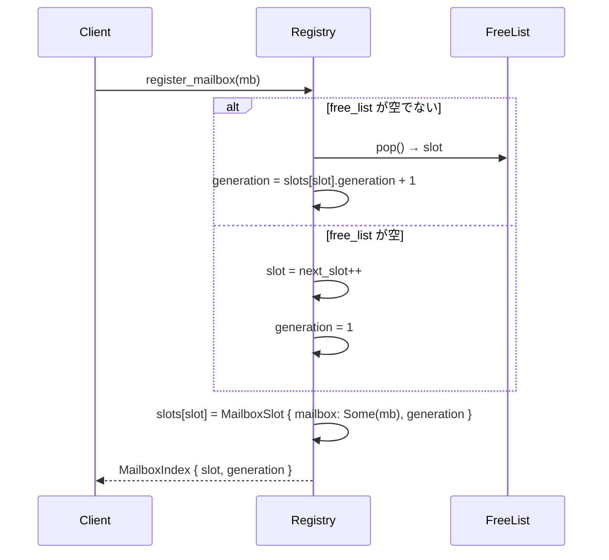
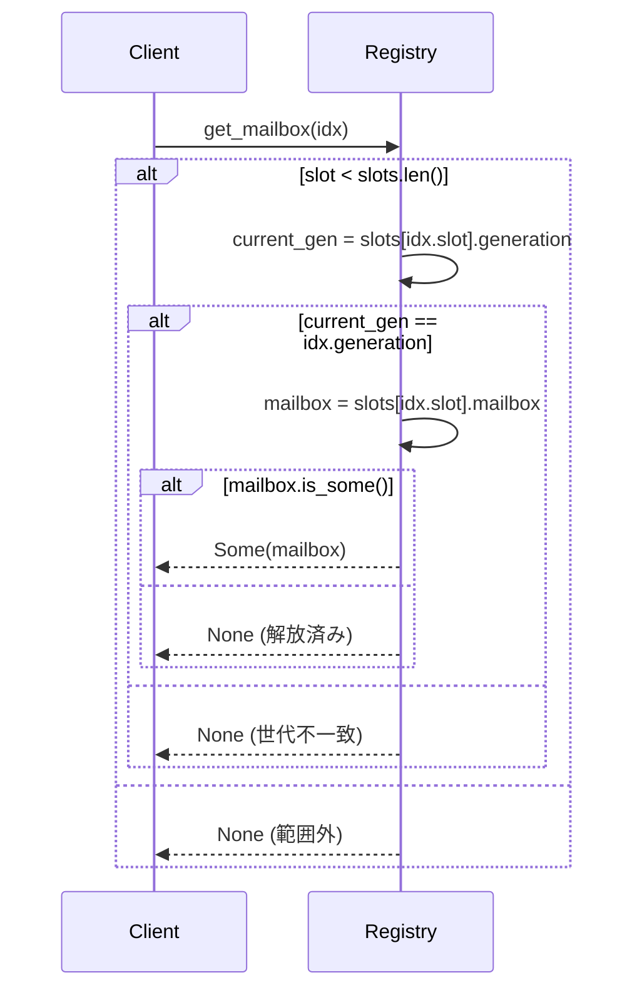

# Generational MailboxIndex 設計とテスト計画

**作成日**: 2025-10-22
**フェーズ**: Phase 0 Week 2
**関連**: ActorScheduler リファクタリング Phase 1-2

## 1. 目的と背景

### 1.1 目的
- **Mailbox の安全な再利用**: アクター停止後にスロットを再利用する際の use-after-free を防ぐ
- **インデックスの一意性保証**: generation カウンタにより古いインデックスの誤参照を検出
- **並行安全性の検証**: loom による並行アクセスの形式検証で競合状態を排除

### 1.2 背景
現行実装では `MailboxIndex` は単純な `u32` スロット番号であり、以下の問題がある：

1. **再利用時の誤参照**: アクターA停止 → スロットN再利用 → アクターBがスロットN取得 → 古いアクターAへの参照が誤ってアクターBを指す
2. **ABA問題**: スロットNが解放され再割り当てされた際、ポインタ比較では検出できない
3. **並行性の検証不足**: 複数スレッドからの同時アクセスで競合状態が発生する可能性

Generational インデックスはこれらを `slot + generation` の組み合わせで解決する。

## 2. MailboxIndex 設計

### 2.1 データ構造

```rust
/// Mailbox index with slot and generation for safe reuse
#[derive(Clone, Copy, Debug, PartialEq, Eq, Hash)]
pub struct MailboxIndex {
  /// Slot number in the registry
  pub slot:       u32,
  /// Generation number to prevent use-after-free
  pub generation: u32,
}

impl MailboxIndex {
  /// Create a new MailboxIndex
  pub fn new(slot: u32, generation: u32) -> Self {
    Self { slot, generation }
  }

  /// Check if this index is valid (non-zero generation)
  pub fn is_valid(&self) -> bool {
    self.generation > 0
  }

  /// Create an invalid/null index
  pub const fn null() -> Self {
    Self { slot: 0, generation: 0 }
  }
}
```

### 2.2 設計原則

- **不変性**: 一度発行された `MailboxIndex` は変更されない（Copy trait）
- **ゼロ検出**: generation = 0 は無効なインデックスを示す
- **オーバーフロー対策**: generation が `u32::MAX` に達した場合はスロットを無効化

### 2.3 サイズとパフォーマンス

- **サイズ**: 64 bits (8 bytes) - キャッシュライン効率を考慮
- **Copy/Clone**: 安価なコピー操作で参照渡しが不要
- **Hash**: HashMap/HashSet での高速ルックアップ

## 3. MailboxRegistry 統合

### 3.1 Registry 内部状態

```rust
struct MailboxSlot<MB> {
  mailbox:    Option<MB>,
  generation: u32,
}

pub struct MailboxRegistry<MB> {
  slots:      Vec<MailboxSlot<MB>>,
  free_list:  Vec<u32>,
  next_slot:  u32,
}
```

### 3.2 インデックス払い出しフロー



### 3.3 インデックス検証フロー



### 3.4 インデックス解放フロー

```rust
impl<MB> MailboxRegistry<MB> {
  pub fn unregister_mailbox(&mut self, idx: MailboxIndex) -> Option<MB> {
    if idx.slot >= self.slots.len() as u32 {
      return None;
    }

    let slot = &mut self.slots[idx.slot as usize];

    // Generation 検証
    if slot.generation != idx.generation {
      return None; // 既に別の世代で再利用済み
    }

    // Mailbox を取り出し
    let mailbox = slot.mailbox.take()?;

    // Generation をインクリメント（次回再利用時に異なる値になる）
    slot.generation = slot.generation.wrapping_add(1);

    // Generation オーバーフロー対策
    if slot.generation == 0 {
      // generation = 0 は無効値として予約
      // このスロットは永久に使用不可
      // 実運用では u32::MAX まで使い切ることは稀
    } else {
      // Free list に返却
      self.free_list.push(idx.slot);
    }

    Some(mailbox)
  }
}
```

## 4. 並行性テスト計画（loom）

### 4.1 loom とは

[loom](https://github.com/tokio-rs/loom) は Rust の並行性バグを検出するモデルチェッカー。
すべての可能なスレッドインターリービングを網羅的に探索し、データ競合やデッドロックを検出する。

### 4.2 テスト対象シナリオ

#### シナリオ 1: 並行 register/unregister

```rust
#[cfg(loom)]
mod loom_tests {
  use loom::sync::Arc;
  use loom::thread;

  #[test]
  fn concurrent_register_unregister() {
    loom::model(|| {
      let registry = Arc::new(Mutex::new(MailboxRegistry::new()));

      let r1 = registry.clone();
      let h1 = thread::spawn(move || {
        let idx = r1.lock().unwrap().register_mailbox("mailbox1");
        idx
      });

      let r2 = registry.clone();
      let h2 = thread::spawn(move || {
        let idx = r2.lock().unwrap().register_mailbox("mailbox2");
        r2.lock().unwrap().unregister_mailbox(idx);
      });

      let idx1 = h1.join().unwrap();
      h2.join().unwrap();

      // idx1 は有効なまま
      assert!(registry.lock().unwrap().get_mailbox(idx1).is_some());
    });
  }
}
```

#### シナリオ 2: ABA 問題の検証

```rust
#[cfg(loom)]
#[test]
fn aba_problem_prevention() {
  loom::model(|| {
    let registry = Arc::new(Mutex::new(MailboxRegistry::new()));

    // スレッド 1: 登録 → 解放
    let r1 = registry.clone();
    let h1 = thread::spawn(move || {
      let idx = r1.lock().unwrap().register_mailbox("A");
      r1.lock().unwrap().unregister_mailbox(idx);
      idx
    });

    let old_idx = h1.join().unwrap();

    // スレッド 2: 同じスロットを再利用
    let r2 = registry.clone();
    let h2 = thread::spawn(move || {
      r2.lock().unwrap().register_mailbox("B")
    });

    let new_idx = h2.join().unwrap();

    // 同じスロット but 異なる generation
    assert_eq!(old_idx.slot, new_idx.slot);
    assert_ne!(old_idx.generation, new_idx.generation);

    // 古いインデックスでアクセスすると None
    assert!(registry.lock().unwrap().get_mailbox(old_idx).is_none());

    // 新しいインデックスは有効
    assert!(registry.lock().unwrap().get_mailbox(new_idx).is_some());
  });
}
```

#### シナリオ 3: 競合する get_mailbox 呼び出し

```rust
#[cfg(loom)]
#[test]
fn concurrent_get_mailbox() {
  loom::model(|| {
    let registry = Arc::new(Mutex::new(MailboxRegistry::new()));
    let idx = registry.lock().unwrap().register_mailbox("shared");

    let r1 = registry.clone();
    let idx1 = idx;
    let h1 = thread::spawn(move || {
      r1.lock().unwrap().get_mailbox(idx1)
    });

    let r2 = registry.clone();
    let idx2 = idx;
    let h2 = thread::spawn(move || {
      r2.lock().unwrap().get_mailbox(idx2)
    });

    let mb1 = h1.join().unwrap();
    let mb2 = h2.join().unwrap();

    // 両方とも同じ mailbox を取得できる
    assert!(mb1.is_some());
    assert!(mb2.is_some());
  });
}
```

#### シナリオ 4: Generation オーバーフロー

```rust
#[test]
fn generation_overflow_safety() {
  let mut registry = MailboxRegistry::new();

  let idx = registry.register_mailbox("test");

  // Generation を u32::MAX - 1 まで進める
  for _ in 0..(u32::MAX - 1) {
    registry.unregister_mailbox(idx);
    // 注: 実装では同じ slot を再利用するため
    // この操作は generation をインクリメントする
  }

  // u32::MAX に到達後、スロットは使用不可になる
  let final_idx = registry.register_mailbox("final");
  assert_ne!(final_idx.slot, idx.slot); // 別のスロットが割り当てられる
}
```

### 4.3 テスト実行方法

```toml
# Cargo.toml
[dev-dependencies]
loom = "0.7"

[[test]]
name = "mailbox_registry_loom"
harness = false
required-features = ["loom"]
```

```bash
# loom テスト実行
RUSTFLAGS="--cfg loom" cargo test --test mailbox_registry_loom --features loom

# 詳細ログ出力
RUST_LOG=trace RUSTFLAGS="--cfg loom" cargo test --test mailbox_registry_loom --features loom -- --nocapture
```

### 4.4 CI 統合

```yaml
# .github/workflows/loom.yml
name: Loom Tests

on: [push, pull_request]

jobs:
  loom:
    runs-on: ubuntu-latest
    steps:
      - uses: actions/checkout@v3
      - uses: dtolnay/rust-toolchain@stable
      - name: Run loom tests
        run: RUSTFLAGS="--cfg loom" cargo test --test mailbox_registry_loom --features loom
        env:
          RUST_BACKTRACE: 1
```

## 5. パフォーマンス考慮事項

### 5.1 メモリオーバーヘッド

- **MailboxIndex**: 8 bytes (slot: 4 bytes + generation: 4 bytes)
- **Registry 内部**: スロットあたり追加 4 bytes（generation カウンタ）
- **トレードオフ**: use-after-free 防止とメモリ効率のバランス

### 5.2 アクセス速度

- **register**: O(1) - free list から pop または next_slot インクリメント
- **get_mailbox**: O(1) - スロット配列への直接アクセス + generation 検証
- **unregister**: O(1) - generation インクリメント + free list への push

### 5.3 最適化戦略

- **Free list のアロケーション削減**: SmallVec で小規模なスタック割り当て
- **スロット配列のプリアロケーション**: 予想される同時アクター数に基づく初期容量
- **Generation インクリメントの最適化**: wrapping_add で overflow を許容

## 6. 実装チェックリスト

### Phase 1 (Week 1-2)
- [ ] MailboxIndex 基本実装（slot + generation）
- [ ] MailboxRegistry プロトタイプ（register/unregister/get）
- [ ] 基本的な単体テスト（有効性検証、null インデックス）
- [ ] loom テストスケルトン作成

### Phase 2 (Week 3-4)
- [ ] loom テスト実装（4シナリオ）
- [ ] CI への loom テスト統合
- [ ] パフォーマンスベンチマーク（register/get/unregister）
- [ ] ドキュメント整備（Rustdoc + 設計書更新）

### Phase 3 (Week 5-6)
- [ ] ReadyQueueCoordinator との統合
- [ ] WorkerExecutor での実利用テスト
- [ ] エッジケース対応（generation overflow, 大量スロット）
- [ ] メモリプロファイリング（valgrind/heaptrack）

## 7. 参考資料

- [Generational Indices](https://lucassardois.medium.com/generational-indices-guide-8e3c5f7fd594)
- [loom Documentation](https://docs.rs/loom/latest/loom/)
- [Slot Map Pattern](https://github.com/orlp/slotmap)
- [Akka ActorRef internals](https://doc.akka.io/docs/akka/current/general/addressing.html)

## 8. FAQ

**Q1. なぜ generation を u64 ではなく u32 にするのか？**
A1. MailboxIndex 全体を 64 bits に収めることで、アトミック操作（AtomicU64）やキャッシュ効率が向上する。u32 の範囲（40億）で generation が枯渇することは実運用上稀であり、枯渇時はスロット無効化で対処する。

**Q2. loom テストは必須か？**
A2. 必須ではないが強く推奨。Registry は並行アクセスの中核であり、データ競合が発生すると致命的なバグとなる。loom は網羅的探索により人手では見つけにくい競合を検出する。

**Q3. Generation overflow 時の影響は？**
A3. 該当スロットが永久に使用不可になるが、u32::MAX（40億）回の再利用後なので実運用では極めて稀。影響範囲は1スロットのみで、システム全体は継続動作する。

**Q4. Free list の代わりに Slab allocator を使えないか？**
A4. Slab は generation 管理を自前で実装する必要がある。Free list + generation カウンタの組み合わせはシンプルで保守性が高く、Phase 0-1 では十分な性能が得られる。Phase 3 以降で lock-free Slab への移行を検討可能。

## 9. 次ステップ

1. **Phase 1 実装開始**: `modules/actor-core/src/api/actor_scheduler/mailbox_registry.rs` の作成
2. **loom テスト作成**: `modules/actor-core/tests/mailbox_registry_loom.rs` の追加
3. **ベンチマーク追加**: `benches/mailbox_registry.rs` でパフォーマンス計測
4. **CI 統合**: `.github/workflows/loom.yml` の追加

---

**作成者**: Claude Code
**レビュー**: 実装チーム / QA
**次回更新予定**: Phase 1 実装完了後（Week 3）
