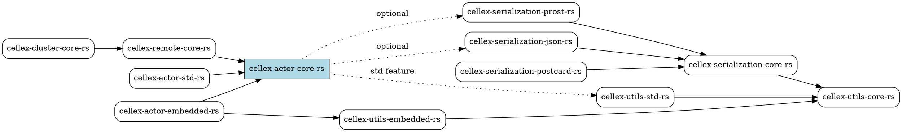
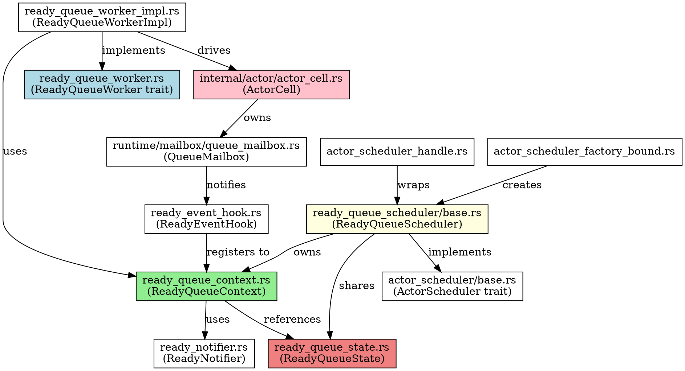
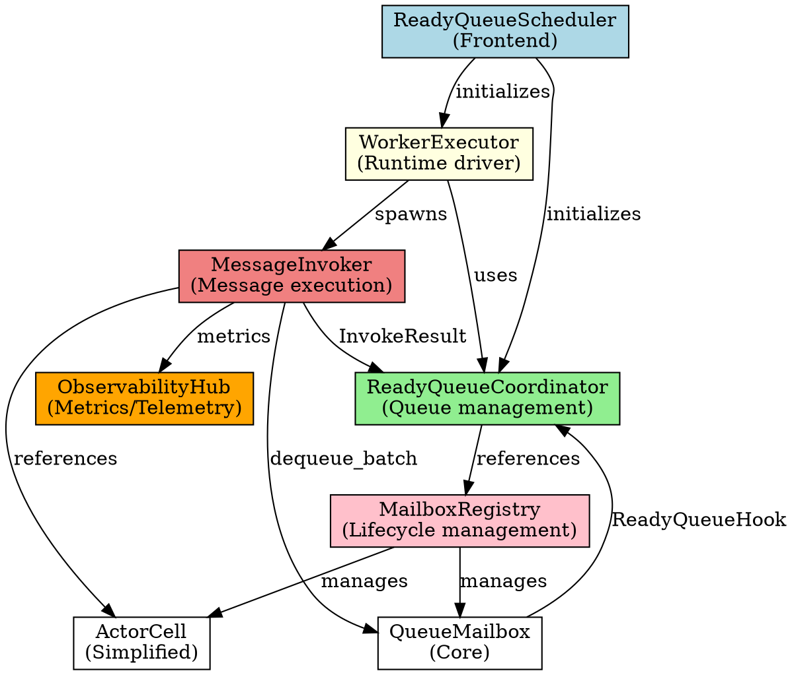

# ActorScheduler 依存関係グラフ

## 1. ワークスペース依存関係



## 2. actor-core 内部モジュール構造

### 2.1 Scheduler 関連モジュール

```
modules/actor-core/src/api/actor_scheduler/
├── actor_scheduler_bound.rs          # ActorScheduler トレイト境界
├── actor_scheduler_factory_bound.rs  # Factory トレイト
├── actor_scheduler_handle.rs         # ハンドル型
├── actor_scheduler_handle_builder.rs # ビルダー
├── actor_scheduler_handle_factory.rs # Factory実装
├── actor_scheduler_spawn_context.rs  # Spawn コンテキスト
├── base.rs                           # ActorScheduler トレイト定義
├── tests.rs                          # 統合テスト
└── ready_queue_scheduler/
    ├── base.rs                       # ReadyQueueScheduler 実装
    ├── ready_queue_context.rs        # Context 実装
    ├── ready_queue_state.rs          # State 実装
    ├── ready_queue_worker.rs         # Worker トレイト
    ├── ready_queue_worker_impl.rs    # Worker 実装
    ├── ready_notifier.rs             # 通知機構
    ├── ready_event_hook.rs           # イベントフック
    └── common.rs                     # 共通定義
```

### 2.2 モジュール依存関係



## 3. 現行実装の責務マッピング

### 3.1 レイヤ構成

| レイヤ | 主な型 | 責務 | 依存先 |
|--------|--------|------|--------|
| **Public API** | `ActorScheduler` trait | 外部インターフェース定義 | - |
| **Scheduler Frontend** | `ReadyQueueScheduler` | 初期化、Context/State所有 | `ReadyQueueContext`, `ReadyQueueState` |
| **Coordinator** | `ReadyQueueContext` | Ready queue操作、Mailbox再登録 | `ReadyQueueState`, `ReadyNotifier` |
| **State Management** | `ReadyQueueState` | queue, queued, running管理 | `VecDeque`, `Vec<bool>` |
| **Worker Driver** | `ReadyQueueWorker` trait<br>`ReadyQueueWorkerImpl` | ワーカループ駆動、ActorCell実行 | `ReadyQueueContext`, `ActorCell` |
| **Invoker** | `ActorCell` | メッセージ実行、サスペンド制御 | `QueueMailbox` |
| **Mailbox** | `QueueMailbox` | enqueue/notify、ReadyQueue再登録 | `ReadyEventHook` |
| **Event Hook** | `ReadyEventHook` | Mailbox → Scheduler 通知 | `ReadyQueueContext` |

### 3.2 データフロー

```
Producer
  ↓ send(msg)
QueueMailbox
  ↓ notify_ready(idx)
ReadyEventHook
  ↓ register_ready(idx)
ReadyQueueContext
  ↓ push to queue
ReadyQueueState
  ↓ drain queue
ReadyQueueWorker
  ↓ process_messages()
ActorCell
  ↓ dequeue_batch()
QueueMailbox
  ↓ handle_envelope()
Actor (user code)
```

## 4. 目標アーキテクチャの依存関係

### 4.1 新規コンポーネント



### 4.2 責務の明確化

| コンポーネント | 現行実装での対応 | 新アーキテクチャでの責務 |
|----------------|------------------|--------------------------|
| **ReadyQueueCoordinator** | `ReadyQueueContext` + `ReadyQueueState` | Ready queue調整、シグナル管理、再登録制御 |
| **WorkerExecutor** | `ReadyQueueWorker` + `ReadyQueueWorkerImpl` | ランタイムタスク生成、ワーカ駆動 |
| **MessageInvoker** | `ActorCell` (一部) | メッセージ実行、Suspend/Resume判定 |
| **MailboxRegistry** | (なし) | Mailbox/ActorCellライフサイクル管理 |
| **ObservabilityHub** | 散在 | メトリクス/テレメトリ統合 |

## 5. 重要な依存関係の変更点

### 5.1 循環依存の解消

**現行実装の問題:**
```
ReadyQueueContext → ReadyQueueState → ReadyQueueContext
ActorCell → QueueMailbox → ReadyEventHook → ReadyQueueContext → ActorCell
```

**目標アーキテクチャ:**
```
ReadyQueueCoordinator → MailboxRegistry → QueueMailbox
(循環なし、一方向の依存のみ)
```

### 5.2 ロック粒度の改善

**現行実装:**
- `ReadyQueueState` 全体を `spin::Mutex` でロック
- `ReadyQueueContext` も `Mutex` で保護
- ワーカごとに同じロックを競合

**目標アーキテクチャ:**
- `ReadyQueueCoordinator` 内部に `ArcShared<AR::SyncMutex<QueueState>>`
- `DashSet` による lock-free な重複登録検知
- クリティカルセクションの最小化

### 5.3 ランタイム抽象化

**現行実装:**
- Tokio 直接依存
- `LocalBoxFuture` による非同期待機
- no_std 対応困難

**目標アーキテクチャ:**
- `RuntimeHandle` トレイトによる抽象化
- Tokio/Embassy/テスト用ランタイムの統一API
- `poll_wait_signal` による no_std 対応

## 6. 移行時の注意点

### 6.1 互換性維持

- `ReadyQueueScheduler` の外部APIは温存
- `ActorScheduler` トレイト実装は変更なし
- 内部実装のみ段階的に置き換え

### 6.2 Feature flag による切り替え

```toml
[features]
new-scheduler = []  # Phase 1-4 で段階的に有効化
```

### 6.3 テスト移行

```
現行テスト (modules/actor-core/src/api/actor_scheduler/tests.rs)
  ↓ 複製・拡張
新規テスト (modules/actor-core/src/api/actor_scheduler/coordinator/tests.rs)
           (modules/actor-core/src/api/actor_scheduler/executor/tests.rs)
           (modules/actor-core/src/api/actor_scheduler/invoker/tests.rs)
```

## 7. 次のステップ

1. ✅ PlantUML図の作成 (`scheduler_component_mapping.puml`, `scheduler_message_flow.puml`)
2. ✅ 依存関係グラフの生成 (このドキュメント)
3. ⏭️ 命名ポリシー ADR の起草 (`docs/adr/2025-10-Phase0-naming.md`)
4. ⏭️ ReadyQueueCoordinator プロトタイプとテスト実装
5. ⏭️ ベンチマーク実行とベースライン保管

---

**生成日時:** 2025-10-22
**対象ブランチ:** refactor/actor-scheduler
**参照ドキュメント:** `docs/design/actor_scheduler_refactor.md`
